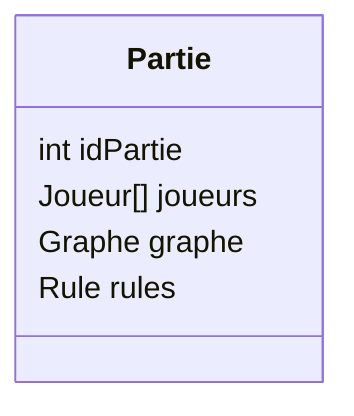

# Compte rendu – Réunion du 13/09

## Projet
Cop's and Robbers – Réunion client avec M. Foucaud

## Date et horaire
15:30 – 16:05

## Participants
- Client: M. Foucaud
- Équipe: Clément, Luc, Tristan, Ange, Ethan, Auguste

## Ordre du jour
- Tour de table des avancements
- Points de vigilance et planning
- Retour sur la gestion de projet

## Avancements par membre
- Clément
   - Mise à jour du front controller
   - Création de la vue de connexion
   - Ajustements de `config.php`
   - Mise à jour de son `.htaccess`
   - Mise à jour du `composer`
   - Normalisation du mécanisme de debug

- Luc
   - Action métier de connexion (reste à finaliser: vue + test fonctionnel côté utilisateur)
   - Développement de la gateway associée
   - Conception et développement de la base de données
       - MCD/MLD
       - Scripts `CREATE TABLE`

- Tristan
   - Reconnaît des difficultés en PHP
   - Travaille sur la fonctionnalité de suppression de compte

- Ange
   - Travail sur les règles du jeu et le moteur
   - Avancement significatif

- Ethan
   - Vue de création de graphe
       - Prototype déjà fonctionnel en JavaScript (déplacement des points possible)
       - Travaille à l’affichage des graphes

- Auguste
   - Configuration du projet
   - Mise en place de `composer` et du fichier `.env`
   - Mise à disposition d’une base de données commune (hébergée sur `aivencloud.com`, `MySQL`)
   - Création et développement du front controller, `config`, `index.php`

## Points de vigilance
- Proximité des échéances (deadlines)
- S’assurer que chaque membre dispose d’actions métier clairement identifiées

## Gestion de projet – retours
- Le client perçoit des défauts d’organisation et de coordination
- Des absences passées d’Auguste ont été signalées; point pris en compte et en amélioration

## Décisions / Suites
- Poursuivre la finalisation de la vue et des tests de connexion
- Maintenir l’effort sur la formalisation des règles et le moteur du jeu
- Continuer l’intégration de la vue de création de graphe et l’affichage des graphes