# reunion de gestion de projet du 05/09/25

pqas de  note a la sortie de la soutenance de 25/09 mais il faut queles commentaire fait a cette soutenance soit pris en compte par ce que dced sera regardé sur la notation du rapport 
démarche positive d'amélioration seront pris en compte faire la soutenance avant de 
tenir compte du départ de chacun dans le prévisionnel 
- identifier la faisabitlité d'un projet 

planification du projet en fonction: 
- en cout 
- en temps 
- en qualité 

rapport du planification a rendre pour le 17 aout (vendredi)
deux apprentissage critique 
faisabilité du projet = cout (en euro)

prévisionnel 

dans la vrai vie : 
- receuil de bsoin 
- chiffrage 
1. à perte soit on veut absolument travailler avec le client soois la perspective d'autre projet serot plus intéressant 
2. faire un suivi du projet 

Sur le suibvi d'un projet on veut un instantée clair : 
on est en avance en retard ou dans les temps et pourquoi a chaque fois 

il faut etre suffisament realiste sur le prévisionnel afin d'avir un prévisionnel et un réel semblable 
 en temps en cout et en qualité 

 il faut donc des indicateurs clair de 

 en gestion de projet la planification prend le plus de temps 

 logiciel des outils 

 ms project pour le projet 
la plannification sera en heure 
il vat etre nécessaire d'ajuster à chaque fois le diagraphe de gant 
il est nécessaire 
sur les deux semestre il a un total de 165 heures 

il vat etre nécessaire de 

il n'est pas nécessaire de saisir dans le calendrier 

la planification comme on l'imagine avec les heures en lien avec la sae on vat pas 

allé chercher la prevision en focnto nn des capacité de chacun soit si on nous dis a ce moment là on est prét c'est que l'on est prêt pour une compétence

un fois que l'on a les livrables : 

il faut faire une liste des taches :
faire un wbs 
les raporter sur un kanban 
sur le stechno que l'on connait pas c'est normal d'avoir des doutes sur le prévisionnel et donc d'avoir des erreurs par extansion 

## Work Breakdown Structure (WBS) - Projet SAE

```mermaid
graph TD
    A["🎯 Projet SAE - 165h total"] --> B["📋 Phase 1: Analyse & Planification"]
    A --> C["💻 Phase 2: Développement"]
    A --> D["📊 Phase 3: Suivi & Contrôle"]
    A --> E["📝 Phase 4: Rapport & Soutenance"]
    
    B --> B1["📊 Recueil des besoins"]
    B --> B2["💰 Chiffrage (coût/temps/qualité)"]
    B --> B3["📅 Planification MS Project"]
    B --> B4["📈 Diagramme de Gantt"]
    B --> B5["🎯 Définition des livrables"]
    
    C --> C1["🏗️ Architecture technique"]
    C --> C2["💻 Développement fonctionnel"]
    C --> C3["🧪 Tests & validation"]
    C --> C4["📚 Documentation technique"]
    
    D --> D1["📊 Indicateurs de suivi"]
    D --> D2["⏰ Contrôle des délais"]
    D --> D3["💰 Suivi budgétaire"]
    D --> D4["🎯 Contrôle qualité"]
    D --> D5["🔄 Ajustements prévisionnel"]
    
    E --> E1["📝 Rédaction rapport"]
    E --> E2["📊 Analyse des écarts"]
    E --> E3["🎤 Préparation soutenance"]
    E --> E4["📅 Soutenance 25/09"]
    E --> E5["🔄 Prise en compte retours"]
    
    style A fill:#e1f5fe,stroke:#01579b,stroke-width:3px
    style B fill:#f3e5f5,stroke:#4a148c,stroke-width:2px
    style C fill:#e8f5e8,stroke:#1b5e20,stroke-width:2px
    style D fill:#fff3e0,stroke:#e65100,stroke-width:2px
    style E fill:#fce4ec,stroke:#880e4f,stroke-width:2px
```

### Points clés de la réunion :
- **Délai critique** : Rapport planification pour le 17 août
- **Objectif** : Prévisionnel réaliste (temps/coût/qualité)
- **Outils** : MS Project + Diagramme de Gantt
- **Suivi** : Indicateurs clairs d'avancement
- **Flexibilité** : Ajustements nécessaires selon les compétences

trouver la bonne plavce a chacun pour l'équipe et rendre colmpte de l'activité professionnel 

ou en est l'équipe etre capable de rendre compte de se qu'il fait 

challenge de travailer autant d'heure ensemble et de savoir qui fait quoi 

ressource prévu matérielle et humaine 
qui vat faire quoi: elle veut que le prévisionnel soit affecter a des personne et que ainsi tout le monde est occupé tout le long du projet 

le prévisionnel veut dire : "regarder ce que l'on est capable de faire dans ce laps de temps"

il y'a des clients qui ne sont jamais satisfait et ainsi que le projet ne finisse jamais 
 