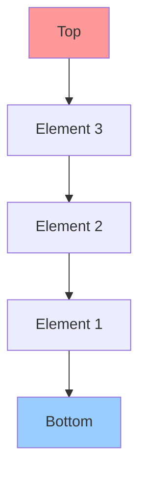
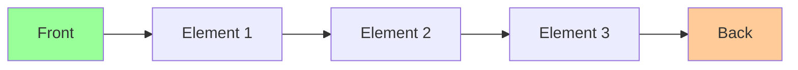
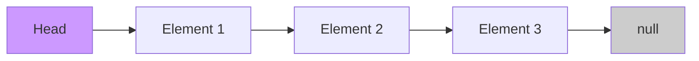
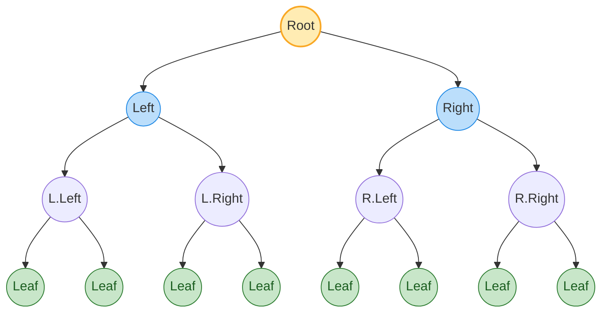
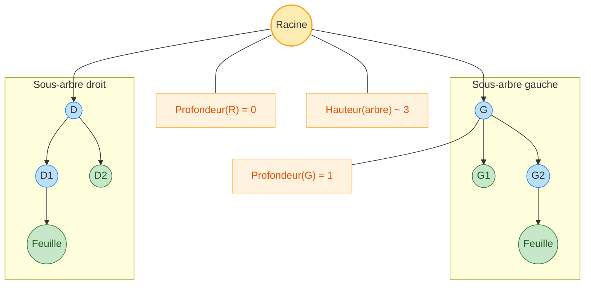
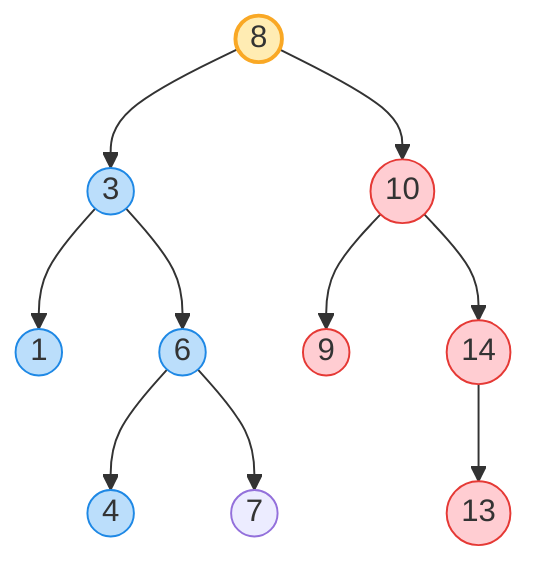

# Liste, Pile, File
- permettent d'accéder <span style="color:#1f75fe"><strong>séquentiellement</strong></span> aux données
- <span style="color:#2e7d32"><strong>accès direct</strong></span> au <span style="color:#2e7d32">premier</span> et/ou <span style="color:#2e7d32">dernier</span> élément
- accès direct au i<sup>ème</sup> élément <span style="color:#d32f2f"><strong>impossible</strong></span>

- nécessitent de parcourir tous les éléments précédents pour atteindre un élément spécifique

## Schémas des structures de données

### Pile (Stack) - LIFO (Last In, First Out)



**Opérations :**
- `push()` : ajouter un élément en haut
- `pop()` : retirer l'élément du haut
- `peek()` : voir l'élément du haut sans le retirer

### File (Queue) - FIFO (First In, First Out)



**Opérations :**
- `enqueue()` : ajouter un élément à l'arrière
- `dequeue()` : retirer l'élément de l'avant
- `peek()` : voir l'élément de l'avant sans le retirer

### Liste chaînée (Linked List)



**Opérations :**
- `insert()` : insérer un élément à une position donnée
- `delete()` : supprimer un élément
- `search()` : rechercher un élément
- `traverse()` : parcourir tous les éléments


# Arbre binaire 
**Définition d'un arbre binaire :**

- Un arbre binaire est une structure de données arborescente dans laquelle chaque <span style="color:#1976d2"><strong>nœud</strong></span> a au plus <span style="color:#6a1b9a"><strong>deux enfants</strong></span>, appelés <span style="color:#2e7d32"><strong>fils gauche</strong></span> et <span style="color:#2e7d32"><strong>fils droit</strong></span>.
- Le nœud supérieur est appelé la <span style="color:#f57c00"><strong>racine</strong></span> (root).
- Un nœud sans enfant est appelé une <span style="color:#388e3c"><strong>feuille</strong></span> (leaf).
- Chaque <span style="color:#00796b"><strong>sous-arbre</strong></span> d’un nœud est lui-même un arbre binaire.
- La <span style="color:#1565c0"><strong>profondeur</strong></span> (ou niveau) d’un nœud correspond au nombre d’arêtes entre ce nœud et la racine.
- La <span style="color:#c62828"><strong>hauteur</strong></span> de l’arbre est la longueur du plus long chemin de la racine à une feuille.
- Les arbres binaires sont <span style="color:#283593"><strong>utilisés</strong></span> pour représenter des structures hiérarchiques, faciliter la recherche, le tri, et d’autres opérations efficaces (ex : arbres de recherche binaires, arbres AVL, arbres rouges-noirs).


## Schéma d'un arbre binaire (équilibré)



## Vocabulaire 
 
**Termes clés :**
- <span style="color:#f57c00"><strong>Racine (root)</strong></span> : nœud sans parent, au sommet de l’arbre.
- <span style="color:#1976d2"><strong>Nœud</strong></span> : élément de l’arbre portant une valeur et des références vers ses enfants.
- <span style="color:#5d4037"><strong>Parent</strong></span> : nœud directement au-dessus d’un autre.
- <span style="color:#2e7d32"><strong>Enfant gauche/droit</strong></span> : nœuds directement sous un parent, à gauche et à droite.
- <span style="color:#6a1b9a"><strong>Nœud interne</strong></span> : nœud ayant au moins un enfant.
- <span style="color:#388e3c"><strong>Feuille (leaf)</strong></span> : nœud sans enfant.
- <span style="color:#00796b"><strong>Sous-arbre</strong></span> : arbre formé par un nœud et tous ses descendants.
- <span style="color:#00796b"><strong>Sous-arbre gauche/droit</strong></span> : sous-arbre enraciné respectivement dans l’enfant gauche/droit.
- <span style="color:#1565c0"><strong>Profondeur d’un nœud</strong></span> : nombre d’arêtes de la racine jusqu’au nœud.
- <span style="color:#c62828"><strong>Hauteur d’un nœud</strong></span> : longueur du plus long chemin du nœud à une feuille.
- <span style="color:#c62828"><strong>Hauteur de l’arbre</strong></span> : hauteur de la racine.

**Schéma annoté :**




## Arbre de recherche binaire (BST)

Un BST impose l'invariant: pour tout <span style="color:#1976d2"><strong>nœud</strong></span> `N` de <span style="color:#6a1b9a"><strong>clé</strong></span> `k`, toutes les clés du <span style="color:#2e7d32"><strong>sous-arbre gauche</strong></span> sont strictement < <span style="color:#6a1b9a"><strong>k</strong></span>, et toutes celles du <span style="color:#e53935"><strong>sous-arbre droit</strong></span> sont strictement > <span style="color:#6a1b9a"><strong>k</strong></span>.

**Schéma (clés ordonnées) :**



**Implémentation en C (BST)**

```c
#include <stdio.h>
#include <stdlib.h>
#include <stdbool.h>

typedef struct TreeNode {
    int key;
    struct TreeNode *left;
    struct TreeNode *right;
} TreeNode;

static TreeNode* create_node(int key) {
    TreeNode *node = (TreeNode*)malloc(sizeof(TreeNode));
    if (!node) {
        fprintf(stderr, "Allocation memoire echouee\n");
        exit(EXIT_FAILURE);
    }
    node->key = key;
    node->left = NULL;
    node->right = NULL;
    return node;
}

TreeNode* bst_insert(TreeNode *root, int key) {
    if (root == NULL) {
        return create_node(key);
    }
    if (key < root->key) {
        root->left = bst_insert(root->left, key);
    } else if (key > root->key) {
        root->right = bst_insert(root->right, key);
    }
    return root; // doublons ignores
}

bool bst_search(TreeNode *root, int key) {
    if (root == NULL) return false;
    if (key == root->key) return true;
    if (key < root->key) return bst_search(root->left, key);
    return bst_search(root->right, key);
}

static TreeNode* find_min(TreeNode *root) {
    while (root && root->left) root = root->left;
    return root;
}

TreeNode* bst_delete(TreeNode *root, int key) {
    if (root == NULL) return NULL;
    if (key < root->key) {
        root->left = bst_delete(root->left, key);
    } else if (key > root->key) {
        root->right = bst_delete(root->right, key);
    } else {
        if (root->left == NULL) {
            TreeNode *rightChild = root->right;
            free(root);
            return rightChild;
        } else if (root->right == NULL) {
            TreeNode *leftChild = root->left;
            free(root);
            return leftChild;
        } else {
            TreeNode *succ = find_min(root->right);
            root->key = succ->key;
            root->right = bst_delete(root->right, succ->key);
        }
    }
    return root;
}

void bst_inorder(TreeNode *root) {
    if (!root) return;
    bst_inorder(root->left);
    printf("%d ", root->key);
    bst_inorder(root->right);
}

void bst_preorder(TreeNode *root) {
    if (!root) return;
    printf("%d ", root->key);
    bst_preorder(root->left);
    bst_preorder(root->right);
}

void bst_postorder(TreeNode *root) {
    if (!root) return;
    bst_postorder(root->left);
    bst_postorder(root->right);
    printf("%d ", root->key);
}

void bst_free(TreeNode *root) {
    if (!root) return;
    bst_free(root->left);
    bst_free(root->right);
    free(root);
}

int main(void) {
    int keys[] = {8, 3, 10, 1, 6, 4, 7, 14, 13, 9};
    size_t n = sizeof(keys)/sizeof(keys[0]);
    TreeNode *root = NULL;
    for (size_t i = 0; i < n; ++i) {
        root = bst_insert(root, keys[i]);
    }

    printf("Inorder (cles triees): ");
    bst_inorder(root);
    printf("\n");

    int q = 7;
    printf("Recherche %d: %s\n", q, bst_search(root, q) ? "trouve" : "non trouve");

    root = bst_delete(root, 8); // supprimer la racine
    printf("Apres suppression 8, inorder: ");
    bst_inorder(root);
    printf("\n");

    bst_free(root);
    return 0;
}
```


## creerArbreVide

Ces fonctions utilisent le type `TreeNode` défini plus haut.

```c
TreeNode* creerArbreVide(void) {
    return NULL; // un arbre vide est représenté par un pointeur NULL
}
```

## estArbreVide

```c
#include <stdbool.h>

bool estArbreVide(TreeNode* racine) {
    return racine == NULL;
}
```

## creerArbreEnracine

```c
#include <stdlib.h>
#include <stdio.h>

TreeNode* creerArbreEnracine(int cle, TreeNode* gauche, TreeNode* droite) {
    TreeNode* noeud = (TreeNode*)malloc(sizeof(TreeNode));
    if (!noeud) {
        fprintf(stderr, "Allocation memoire echouee\n");
        return NULL;
    }
    noeud->key = cle;
    noeud->left = gauche;
    noeud->right = droite;
    return noeud;
}
```


## tailleArbre

Nombre total de nœuds de l'arbre.

```c
#include <stddef.h>

size_t tailleArbre(TreeNode* racine) {
    if (racine == NULL) return 0;
    return 1 + tailleArbre(racine->left) + tailleArbre(racine->right);
}
```

## hauteurArbre

Hauteur définie comme la longueur (en arêtes) du plus long chemin jusqu'à une feuille. Par convention, la hauteur d'un arbre vide est -1 et celle d'une feuille est 0.

```c
int hauteurArbre(TreeNode* racine) {
    if (racine == NULL) return -1; // arbre vide
    int hG = hauteurArbre(racine->left);
    int hD = hauteurArbre(racine->right);
    return 1 + (hG > hD ? hG : hD);
}
```

## parcours 
```c
// Parcours préfixe (pré-ordre)
void parcoursPrefixe(TreeNode* racine) {
    if (racine == NULL) return;
    printf("%d ", racine->key);              // Visite la racine
    parcoursPrefixe(racine->left);           // Parcours sous-arbre gauche
    parcoursPrefixe(racine->right);          // Parcours sous-arbre droit
}

// Parcours infixe (in-ordre)
void parcoursInfixe(TreeNode* racine) {
    if (racine == NULL) return;
    parcoursInfixe(racine->left);            // Parcours sous-arbre gauche
    printf("%d ", racine->key);              // Visite la racine
    parcoursInfixe(racine->right);           // Parcours sous-arbre droit
}

// Parcours postfixe (post-ordre)
void parcoursPostfixe(TreeNode* racine) {
    if (racine == NULL) return;
    parcoursPostfixe(racine->left);          // Parcours sous-arbre gauche
    parcoursPostfixe(racine->right);         // Parcours sous-arbre droit
    printf("%d ", racine->key);              // Visite la racine
}
```


