# Liste, Pile, File
- permettent d'accéder <span style="color:#1f75fe"><strong>séquentiellement</strong></span> aux données
- <span style="color:#2e7d32"><strong>accès direct</strong></span> au <span style="color:#2e7d32">premier</span> et/ou <span style="color:#2e7d32">dernier</span> élément
- accès direct au i<sup>ème</sup> élément <span style="color:#d32f2f"><strong>impossible</strong></span>

- nécessitent de parcourir tous les éléments précédents pour atteindre un élément spécifique

## Schémas des structures de données

### Pile (Stack) - LIFO (Last In, First Out)

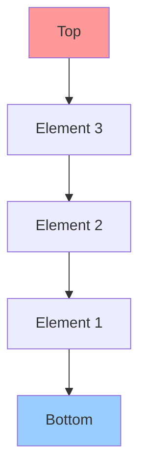

**Opérations :**
- `push()` : ajouter un élément en haut
- `pop()` : retirer l'élément du haut
- `peek()` : voir l'élément du haut sans le retirer

### File (Queue) - FIFO (First In, First Out)

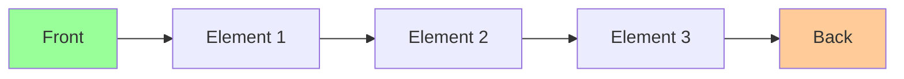

**Opérations :**
- `enqueue()` : ajouter un élément à l'arrière
- `dequeue()` : retirer l'élément de l'avant
- `peek()` : voir l'élément de l'avant sans le retirer

### Liste chaînée (Linked List)


**Opérations :**
- `insert()` : insérer un élément à une position donnée
- `delete()` : supprimer un élément
- `search()` : rechercher un élément
- `traverse()` : parcourir tous les éléments


# Arbre binaire 
**Définition d'un arbre binaire :**

- Un arbre binaire est une structure de données arborescente dans laquelle chaque <span style="color:#1976d2"><strong>nœud</strong></span> a au plus <span style="color:#6a1b9a"><strong>deux enfants</strong></span>, appelés <span style="color:#2e7d32"><strong>fils gauche</strong></span> et <span style="color:#2e7d32"><strong>fils droit</strong></span>.
- Le nœud supérieur est appelé la <span style="color:#f57c00"><strong>racine</strong></span> (root).
- Un nœud sans enfant est appelé une <span style="color:#388e3c"><strong>feuille</strong></span> (leaf).
- Chaque <span style="color:#00796b"><strong>sous-arbre</strong></span> d’un nœud est lui-même un arbre binaire.
- La <span style="color:#1565c0"><strong>profondeur</strong></span> (ou niveau) d’un nœud correspond au nombre d’arêtes entre ce nœud et la racine.
- La <span style="color:#c62828"><strong>hauteur</strong></span> de l’arbre est la longueur du plus long chemin de la racine à une feuille.
- Les arbres binaires sont <span style="color:#283593"><strong>utilisés</strong></span> pour représenter des structures hiérarchiques, faciliter la recherche, le tri, et d’autres opérations efficaces (ex : arbres de recherche binaires, arbres AVL, arbres rouges-noirs).


## Schéma d'un arbre binaire (équilibré)

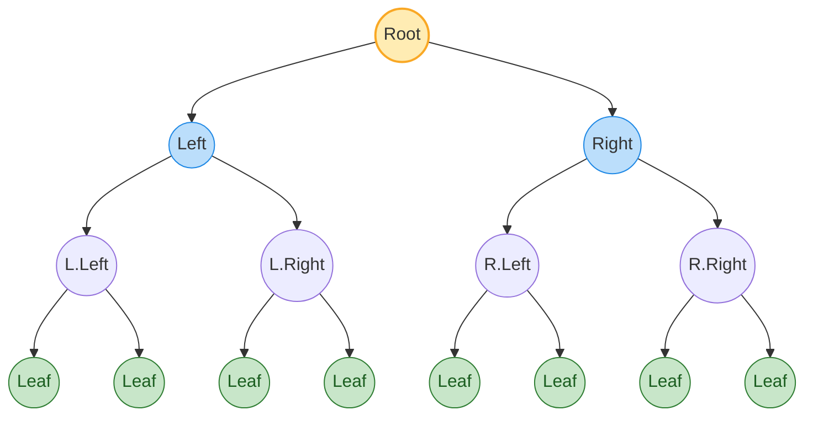

## Vocabulaire 
 
**Termes clés :**
- <span style="color:#f57c00"><strong>Racine (root)</strong></span> : nœud sans parent, au sommet de l’arbre.
- <span style="color:#1976d2"><strong>Nœud</strong></span> : élément de l’arbre portant une valeur et des références vers ses enfants.
- <span style="color:#5d4037"><strong>Parent</strong></span> : nœud directement au-dessus d’un autre.
- <span style="color:#2e7d32"><strong>Enfant gauche/droit</strong></span> : nœuds directement sous un parent, à gauche et à droite.
- <span style="color:#6a1b9a"><strong>Nœud interne</strong></span> : nœud ayant au moins un enfant.
- <span style="color:#388e3c"><strong>Feuille (leaf)</strong></span> : nœud sans enfant.
- <span style="color:#00796b"><strong>Sous-arbre</strong></span> : arbre formé par un nœud et tous ses descendants.
- <span style="color:#00796b"><strong>Sous-arbre gauche/droit</strong></span> : sous-arbre enraciné respectivement dans l’enfant gauche/droit.
- <span style="color:#1565c0"><strong>Profondeur d’un nœud</strong></span> : nombre d’arêtes de la racine jusqu’au nœud.
- <span style="color:#c62828"><strong>Hauteur d’un nœud</strong></span> : longueur du plus long chemin du nœud à une feuille.
- <span style="color:#c62828"><strong>Hauteur de l’arbre</strong></span> : hauteur de la racine.

**Schéma annoté :**

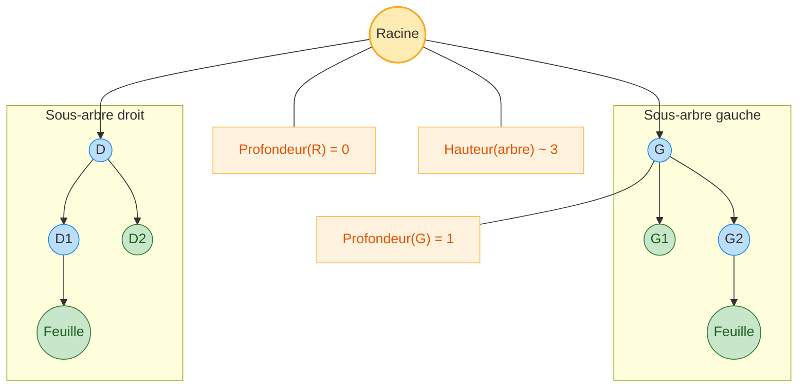

## Arbre de recherche binaire (BST)

Un BST impose l'invariant: pour tout <span style="color:#1976d2"><strong>nœud</strong></span> `N` de <span style="color:#6a1b9a"><strong>clé</strong></span> `k`, toutes les clés du <span style="color:#2e7d32"><strong>sous-arbre gauche</strong></span> sont strictement < <span style="color:#6a1b9a"><strong>k</strong></span>, et toutes celles du <span style="color:#e53935"><strong>sous-arbre droit</strong></span> sont strictement > <span style="color:#6a1b9a"><strong>k</strong></span>.

**Schéma (clés ordonnées) :**

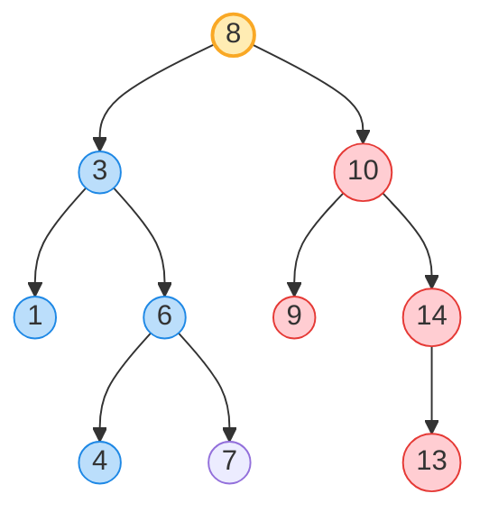

**Implémentation en C (BST)**

```c
#include <stdio.h>
#include <stdlib.h>
#include <stdbool.h>

typedef struct TreeNode {
    int key;
    struct TreeNode *left;
    struct TreeNode *right;
} TreeNode;

static TreeNode* create_node(int key) {
    TreeNode *node = (TreeNode*)malloc(sizeof(TreeNode));
    if (!node) {
        fprintf(stderr, "Allocation memoire echouee\n");
        exit(EXIT_FAILURE);
    }
    node->key = key;
    node->left = NULL;
    node->right = NULL;
    return node;
}

TreeNode* bst_insert(TreeNode *root, int key) {
    if (root == NULL) {
        return create_node(key);
    }
    if (key < root->key) {
        root->left = bst_insert(root->left, key);
    } else if (key > root->key) {
        root->right = bst_insert(root->right, key);
    }
    return root; // doublons ignores
}

bool bst_search(TreeNode *root, int key) {
    if (root == NULL) return false;
    if (key == root->key) return true;
    if (key < root->key) return bst_search(root->left, key);
    return bst_search(root->right, key);
}

static TreeNode* find_min(TreeNode *root) {
    while (root && root->left) root = root->left;
    return root;
}

TreeNode* bst_delete(TreeNode *root, int key) {
    if (root == NULL) return NULL;
    if (key < root->key) {
        root->left = bst_delete(root->left, key);
    } else if (key > root->key) {
        root->right = bst_delete(root->right, key);
    } else {
        if (root->left == NULL) {
            TreeNode *rightChild = root->right;
            free(root);
            return rightChild;
        } else if (root->right == NULL) {
            TreeNode *leftChild = root->left;
            free(root);
            return leftChild;
        } else {
            TreeNode *succ = find_min(root->right);
            root->key = succ->key;
            root->right = bst_delete(root->right, succ->key);
        }
    }
    return root;
}

void bst_inorder(TreeNode *root) {
    if (!root) return;
    bst_inorder(root->left);
    printf("%d ", root->key);
    bst_inorder(root->right);
}

void bst_preorder(TreeNode *root) {
    if (!root) return;
    printf("%d ", root->key);
    bst_preorder(root->left);
    bst_preorder(root->right);
}

void bst_postorder(TreeNode *root) {
    if (!root) return;
    bst_postorder(root->left);
    bst_postorder(root->right);
    printf("%d ", root->key);
}

void bst_free(TreeNode *root) {
    if (!root) return;
    bst_free(root->left);
    bst_free(root->right);
    free(root);
}

int main(void) {
    int keys[] = {8, 3, 10, 1, 6, 4, 7, 14, 13, 9};
    size_t n = sizeof(keys)/sizeof(keys[0]);
    TreeNode *root = NULL;
    for (size_t i = 0; i < n; ++i) {
        root = bst_insert(root, keys[i]);
    }

    printf("Inorder (cles triees): ");
    bst_inorder(root);
    printf("\n");

    int q = 7;
    printf("Recherche %d: %s\n", q, bst_search(root, q) ? "trouve" : "non trouve");

    root = bst_delete(root, 8); // supprimer la racine
    printf("Apres suppression 8, inorder: ");
    bst_inorder(root);
    printf("\n");

    bst_free(root);
    return 0;
}
```


## creerArbreVide

Ces fonctions utilisent le type `TreeNode` défini plus haut.

```c
TreeNode* creerArbreVide(void) {
    return NULL; // un arbre vide est représenté par un pointeur NULL
}
```

## estArbreVide

```c
#include <stdbool.h>

bool estArbreVide(TreeNode* racine) {
    return racine == NULL;
}
```

## creerArbreEnracine

```c
#include <stdlib.h>
#include <stdio.h>

TreeNode* creerArbreEnracine(int cle, TreeNode* gauche, TreeNode* droite) {
    TreeNode* noeud = (TreeNode*)malloc(sizeof(TreeNode));
    if (!noeud) {
        fprintf(stderr, "Allocation memoire echouee\n");
        return NULL;
    }
    noeud->key = cle;
    noeud->left = gauche;
    noeud->right = droite;
    return noeud;
}
```


## tailleArbre

Nombre total de nœuds de l'arbre.

```c
#include <stddef.h>

size_t tailleArbre(TreeNode* racine) {
    if (racine == NULL) return 0;
    return 1 + tailleArbre(racine->left) + tailleArbre(racine->right);
}
```

## hauteurArbre

Hauteur définie comme la longueur (en arêtes) du plus long chemin jusqu'à une feuille. Par convention, la hauteur d'un arbre vide est -1 et celle d'une feuille est 0.

```c
int hauteurArbre(TreeNode* racine) {
    if (racine == NULL) return -1; // arbre vide
    int hG = hauteurArbre(racine->left);
    int hD = hauteurArbre(racine->right);
    return 1 + (hG > hD ? hG : hD);
}
```

## parcours 
```c
// Parcours préfixe (pré-ordre)
void parcoursPrefixe(TreeNode* racine) {
    if (racine == NULL) return;
    printf("%d ", racine->key);              // Visite la racine
    parcoursPrefixe(racine->left);           // Parcours sous-arbre gauche
    parcoursPrefixe(racine->right);          // Parcours sous-arbre droit
}

// Parcours infixe (in-ordre)
void parcoursInfixe(TreeNode* racine) {
    if (racine == NULL) return;
    parcoursInfixe(racine->left);            // Parcours sous-arbre gauche
    printf("%d ", racine->key);              // Visite la racine
    parcoursInfixe(racine->right);           // Parcours sous-arbre droit
}

// Parcours postfixe (post-ordre)
void parcoursPostfixe(TreeNode* racine) {
    if (racine == NULL) return;
    parcoursPostfixe(racine->left);          // Parcours sous-arbre gauche
    parcoursPostfixe(racine->right);         // Parcours sous-arbre droit
    printf("%d ", racine->key);              // Visite la racine
}
```


### Exemple Arbre binaire de Recherche (ABR)

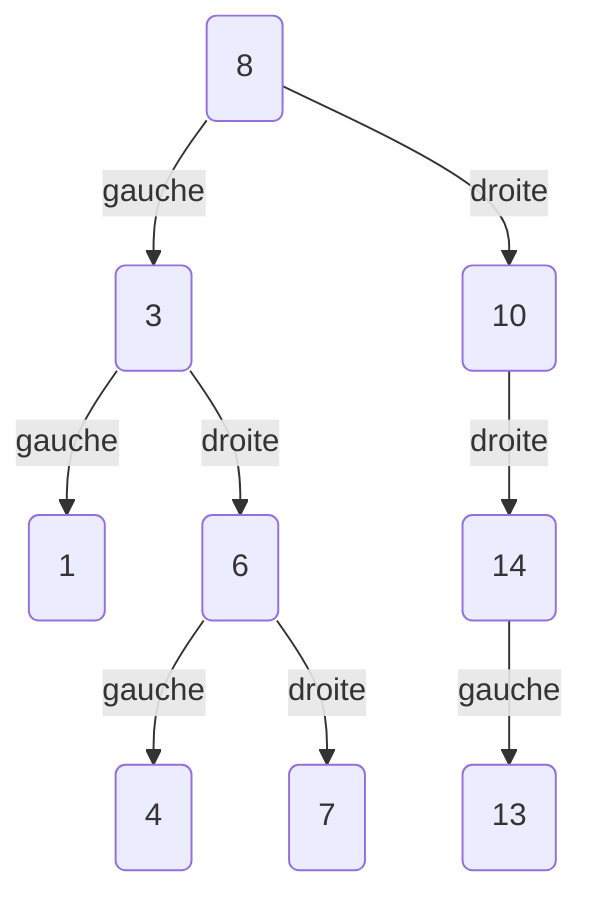

- Données insérées (dans l’ordre): 8, 3, 10, 1, 6, 14, 4, 7, 13.  

- Règle d’insertion: pour chaque valeur, partir de la racine; si la valeur est strictement inférieure au nœud courant, aller à gauche, sinon aller à droite; répéter jusqu’à trouver une place vide et y créer le nœud.   

- Cette procédure construit un arbre où tout sous-arbre gauche contient des valeurs < nœud, et tout sous-arbre droit des valeurs ≥ nœud.  

## ABR: Insertion (en feuille) 


L'insertion « en feuille » consiste à descendre depuis la racine en respectant l'invariant de l'ABR jusqu'à trouver un pointeur `NULL`, puis à y raccrocher le nouveau nœud.

- Règle: si la clé à insérer est < clé du nœud courant, aller à gauche, sinon aller à droite.
- Arrêt: dès qu'on rencontre un pointeur `NULL` (emplacement vide), on crée le nœud et on le place ici.
- Doublons: souvent ignorés (aucune insertion si la clé existe déjà).

Complexité: O(h), où h est la hauteur de l'arbre. Équilibré: O(log n). Dégénéré: O(n).

```c
// Variante itérative (insertion en feuille)
TreeNode* bst_insert_iter(TreeNode* root, int key) {
    TreeNode* parent = NULL;
    TreeNode* cur = root;
    // Chercher l'emplacement (feuille) où insérer
    while (cur != NULL) {
        parent = cur;
        if (key < cur->key) cur = cur->left;
        else if (key > cur->key) cur = cur->right;
        else return root; // doublon: ne rien faire
    }
    // Créer le nouveau nœud
    TreeNode* node = create_node(key);
    if (parent == NULL) return node; // arbre initialement vide
    if (key < parent->key) parent->left = node; else parent->right = node;
    return root;
}
```

### Schémas Mermaid: insertion en feuille pas à pas

1) Départ (arbre vide) → insérer 8

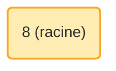

2) Insérer 3 (3 < 8 → gauche)

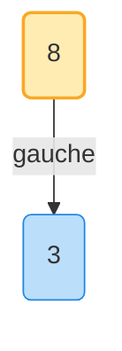

3) Insérer 6 (6 < 8 → gauche; 6 > 3 → droite)

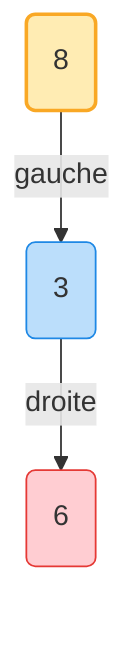

4) Insérer 5 (chemin: 5 < 8 → G; 5 > 3 → D; 5 < 6 → G)

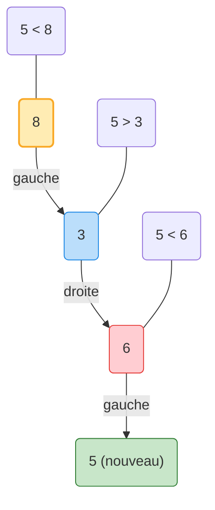


5) Insérer 2 (chemin: 2 < 8 → G; 2 < 3 → G)

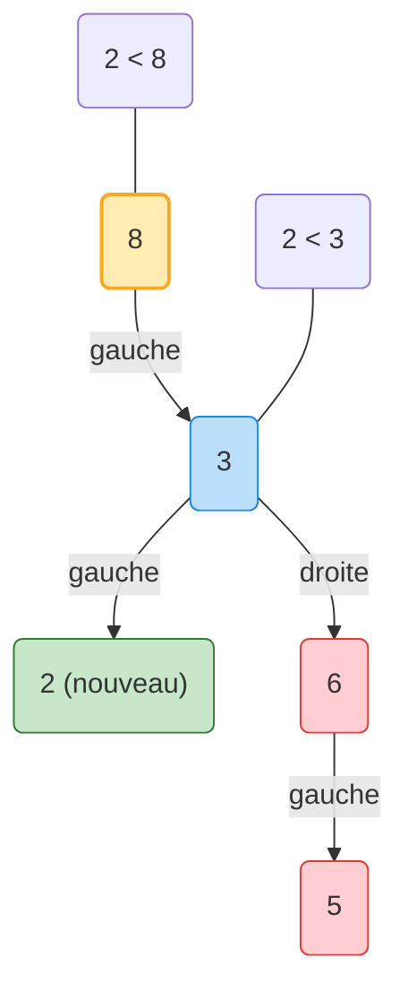

6) Insérer 10 (chemin: 10 > 8 → D)

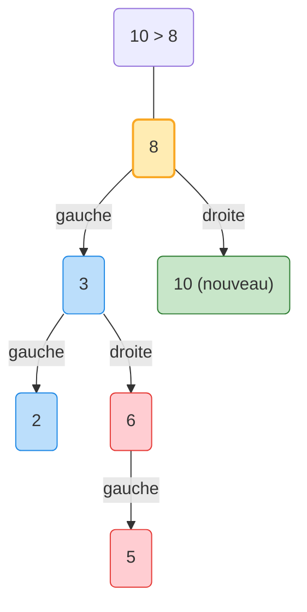

#### Fonction d'ajout en feuille (C)

```c
// Insère la clé 'cle' en feuille dans un ABR.
// - Retourne la nouvelle racine (inchangée sauf si l'arbre était vide)
// - Doublons ignorés (aucune insertion si 'cle' existe déjà)
TreeNode* ajouterEnFeuille(TreeNode* racine, int cle) {
    TreeNode* parent = NULL;
    TreeNode* courant = racine;

    // Descente jusqu'à trouver un emplacement NULL
    while (courant != NULL) {
        parent = courant;
        if (cle < courant->key) {
            courant = courant->left;
        } else if (cle > courant->key) {
            courant = courant->right;
        } else {
            return racine; // doublon
        }
    }

    // Crée le nouveau nœud et l'accroche au parent
    TreeNode* noeud = create_node(cle);
    if (parent == NULL) {
        // Arbre initialement vide
        return noeud;
    }
    if (cle < parent->key) parent->left = noeud; else parent->right = noeud;
    return racine;
}
```


## ABR: Suppression (pas à pas)

La suppression d'une clé `k` dans un ABR suit 3 cas:
- Cas 1: `k` est une feuille → on supprime simplement le nœud.
- Cas 2: `k` a un seul enfant → on « raccroche » l'enfant au parent (bypass).
- Cas 3: `k` a deux enfants → on remplace la clé par celle de son successeur (min du sous-arbre droit), puis on supprime le successeur.

On part de la forme générale construite plus haut: {8, 3, 10, 2, 6, 5}.

1) Supprimer 5 (feuille)

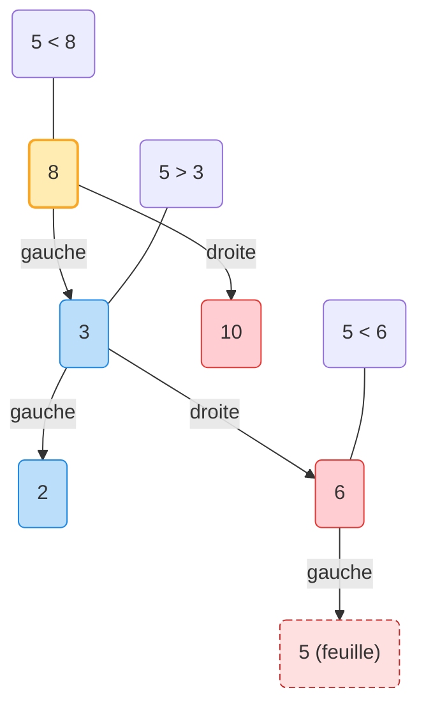

Résultat: on enlève `5`, `6` devient feuille.

2) Supprimer 6 (un seul enfant)

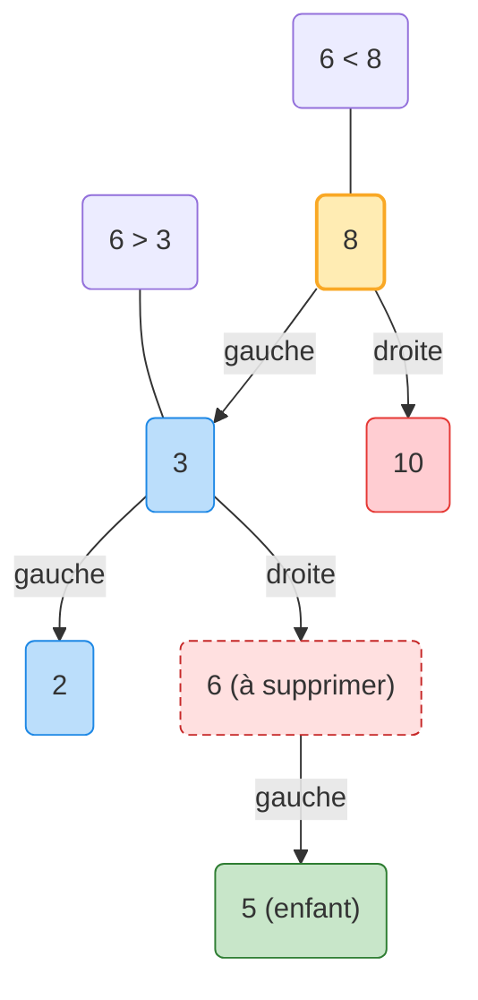

Résultat: on bypasse `6` et on raccorde `5` comme enfant droit de `3`.

3) Supprimer 8 (deux enfants) → remplacer par le successeur (min du sous-arbre droit)

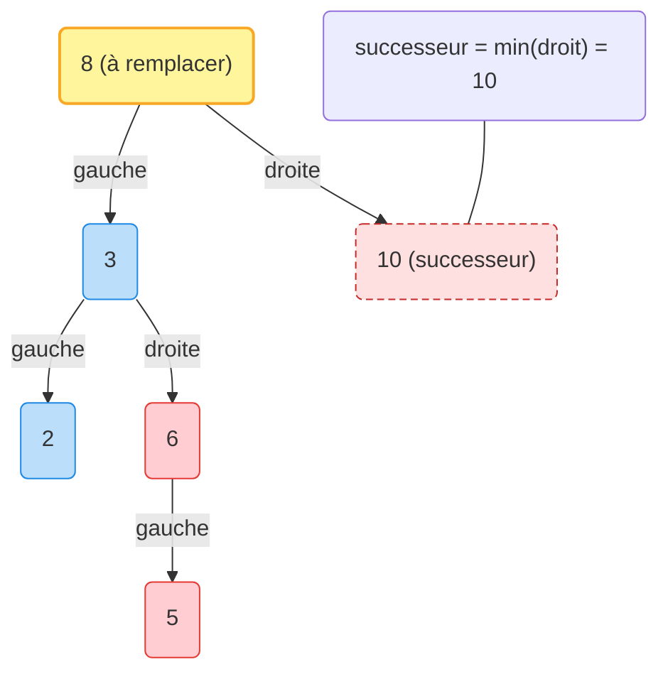

Résultat: la clé de `8` est remplacée par `10`, puis le nœud `10` du sous-arbre droit est supprimé.


## Arbres AVL

Un arbre AVL est un ABR auto-équilibré: pour tout nœud, la différence de hauteur entre le sous-arbre gauche et le sous-arbre droit (facteur d’équilibre `FE = h(gauche) - h(droit)`) est toujours dans {−1, 0, +1}.

- Recherche/Insertion/Suppression: O(log n) grâce à l’équilibrage.
- Ré-équilibrage par rotations: simple droite (RR), simple gauche (LL), double gauche-droite (LR), double droite-gauche (RL).

### Schéma d’un AVL équilibré

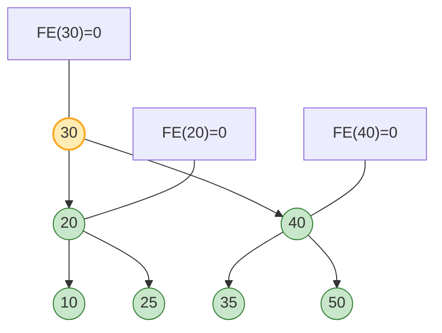

Exigence AVL: après chaque insertion/suppression, on met à jour les hauteurs, calcule `FE`, et si `|FE| > 1`, on applique la rotation appropriée (LL, RR, LR, RL) au premier nœud déséquilibré rencontré en remontant.

#### AVL : Rotation 

#### AVL hauteur de noeud

Aprés une insertion ou une suppression, l'AVL obtenu est équilibré oupas 4 cas de déséquilibré exista,t 
En ca de déséquilibre, L'AVL peu tetre rééquilibrer enutilisant une ou deux rotation 

##### Code C pour AVL (hauteur, FE, rotations, insertion, suppression)

```c
// Hauteur d'un nœud (NULL = -1)
static int height(TreeNode* n) {
    if (n == NULL) return -1;
    int hg = height(n->left);
    int hd = height(n->right);
    return (hg > hd ? hg : hd) + 1;
}

// Facteur d'équilibre
static int getBalance(TreeNode* n) {
    if (n == NULL) return 0;
    return height(n->left) - height(n->right);
}

// Rotation droite (RR)
static TreeNode* rotateRight(TreeNode* z) {
    TreeNode* y = z->left;
    TreeNode* T2 = y->right;
    y->right = z;
    z->left = T2;
    return y; // nouvelle racine du sous-arbre
}

// Rotation gauche (LL)
static TreeNode* rotateLeft(TreeNode* z) {
    TreeNode* y = z->right;
    TreeNode* T2 = y->left;
    y->left = z;
    z->right = T2;
    return y; // nouvelle racine du sous-arbre
}

// Rééquilibre un nœud n après insertion/suppression
static TreeNode* rebalance(TreeNode* n) {
    int balance = getBalance(n);
    if (balance > 1) {
        // surpoids à gauche
        if (getBalance(n->left) < 0) {
            n->left = rotateLeft(n->left); // cas LR
        }
        return rotateRight(n); // cas LL
    } else if (balance < -1) {
        // surpoids à droite
        if (getBalance(n->right) > 0) {
            n->right = rotateRight(n->right); // cas RL
        }
        return rotateLeft(n); // cas RR
    }
    return n; // déjà équilibré
}

TreeNode* avl_insert(TreeNode* root, int key) {
    if (root == NULL) return create_node(key);
    if (key < root->key) root->left = avl_insert(root->left, key);
    else if (key > root->key) root->right = avl_insert(root->right, key);
    else return root; // doublon ignoré
    return rebalance(root);
}

static TreeNode* findMin(TreeNode* n) {
    while (n && n->left) n = n->left;
    return n;
}

TreeNode* avl_delete(TreeNode* root, int key) {
    if (root == NULL) return NULL;
    if (key < root->key) root->left = avl_delete(root->left, key);
    else if (key > root->key) root->right = avl_delete(root->right, key);
    else {
        // suppression du nœud root
        if (root->left == NULL || root->right == NULL) {
            TreeNode* child = root->left ? root->left : root->right;
            if (child == NULL) {
                // pas d'enfant
                free(root);
                return NULL;
            } else {
                // un enfant
                TreeNode* tmp = child;
                free(root);
                return tmp;
            }
        } else {
            // deux enfants: successeur
            TreeNode* succ = findMin(root->right);
            root->key = succ->key;
            root->right = avl_delete(root->right, succ->key);
        }
    }
    // rééquilibrer en remontant
    return rebalance(root);
}
```

##### Suppression en AVL (pas à pas, avec rééquilibrage)

Exemple: depuis l’AVL précédent, supprimer 10 puis 40 pour provoquer un cas RR au nœud 25.

1) Avant suppression

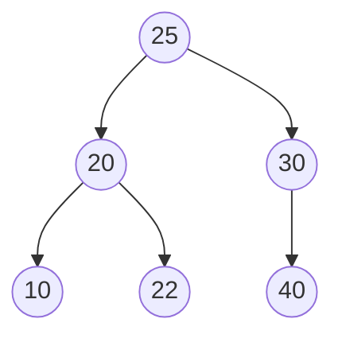

2) Supprimer 40 (feuille)

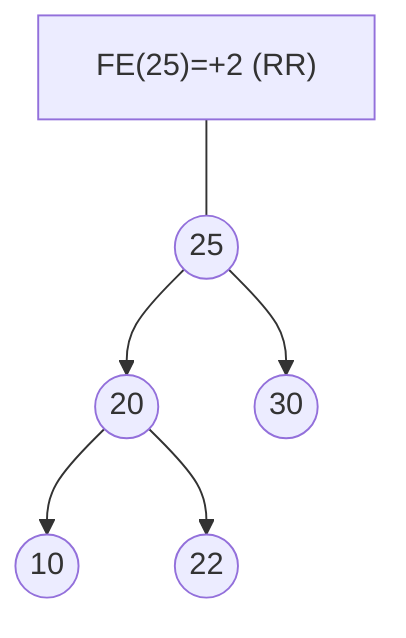

3) Rééquilibrage RR: rotation droite sur 25/20

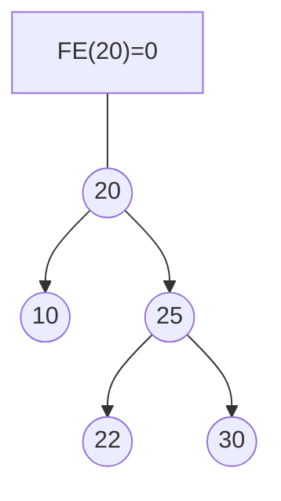

##### Insertion en AVL (pas à pas, avec rééquilibrage)

Exemple: insertion dans l’ordre 30, 20, 40, 10, 25, 22 provoque un cas LR au nœud 30.

1) Avant déséquilibre

```mermaid
flowchart TD
    N30(("30"))
    N20(("20"))
    N40(("40"))
    N10(("10"))
    N25(("25"))
    N22(("22 (nouveau)"))

    N30 --> N20
    N30 --> N40
    N20 --> N10
    N20 --> N25
    N25 --> N22

    FE30["FE(30)=+2 (LR)"] --- N30
```

2) Rééquilibrage LR: rotation gauche sur 20/25 puis rotation droite sur 30/25

```mermaid
flowchart TD
    N25(("25"))
    N20(("20"))
    N30(("30"))
    N10(("10"))
    N22(("22"))
    N40(("40"))

    N25 --> N20
    N25 --> N30
    N20 --> N10
    N20 --> N22
    N30 --> N40

    FE25["FE(25)=0"] --- N25
```
##### Hauteur et facteur d’équilibre (FE)

- Hauteur d’un nœud: longueur du plus long chemin vers une feuille. Convention: `h(NULL) = -1`.
- Facteur d’équilibre: `FE(n) = h(n.gauche) - h(n.droit)`.
- Propriété AVL: pour tout nœud `n`, `FE(n) ∈ { -1, 0, +1 }`.

Mise à jour après insertion/suppression: en remontant depuis le nœud modifié, on met à jour `h(n)` et `FE(n)`, et si `|FE(n)| > 1`, on applique une rotation adaptée.

##### Rotations AVL (schémas)

1) Rotation simple droite (RR) — déséquilibre Gauche-Gauche

```mermaid
flowchart LR
    subgraph Avant
      direction TB
      Z(("Z"))
      Y(("Y"))
      X(("X"))
      Z --> Y
      Y --> X
    end
    
    subgraph Après
      direction TB
      Y2(("Y"))
      X2(("X"))
      Z2(("Z"))
      Y2 --> X2
      Y2 --> Z2
    end
```

2) Rotation simple gauche (LL) — déséquilibre Droite-Droite

```mermaid
flowchart LR
    subgraph Avant
      direction TB
      Z(("Z"))
      Y(("Y"))
      X(("X"))
      Z --> Y
      Y --> X
    end
    
    subgraph Après
      direction TB
      Y2(("Y"))
      Z2(("Z"))
      X2(("X"))
      Y2 --> Z2
      Y2 --> X2
    end
```

3) Rotation double gauche-droite (LR) — déséquilibre Gauche-Droite

```mermaid
flowchart LR
    subgraph Avant
      direction TB
      Z(("Z"))
      Y(("Y"))
      X(("X"))
      Z --> Y
      Y --> X
    end
    
    subgraph Après
      direction TB
      X2(("X"))
      Y2(("Y"))
      Z2(("Z"))
      X2 --> Y2
      X2 --> Z2
    end
```

4) Rotation double droite-gauche (RL) — déséquilibre Droite-Gauche

```mermaid
flowchart LR
    subgraph Avant
      direction TB
      Z(("Z"))
      Y(("Y"))
      X(("X"))
      Z --> Y
      Y --> X
    end
    
    subgraph Après
      direction TB
      X2(("X"))
      Z2(("Z"))
      Y2(("Y"))
      X2 --> Z2
      X2 --> Y2
    end
```

# GRATHE 


## La structure 
 
```c 
typedef struct CellSommet{
    TypeVal num; 
    struct CellSommet *suiv;
    struct CellArc *listArcs;
}Sommet; 

typedef struct CellArc {
    Sommet *extremite;
    struct CellArc *suivant;
}Arc;

typedef Sommet * Graphe;
```c
Sommet* rechPtSurSommet(Graphe R, int num) {
    Sommet* p = R;
    while (p != NULL) {
        if (p->num == num) return p;
        p = p->suiv;
    }
    return NULL;
}
```


```c
CodeRetour ajouterSommet(Graphe *ptg, int num){
    if (ptg == NULL) return PB_GRAPHE; 
    if (rechercherSommet(*ptg, num) == VRAI) return PB_SOMMET_DEJA_EXISTANT;

    Sommet *nv = (Sommet*)malloc(sizeof(Sommet));
    if (nv == NULL) return PB_MEMOIRE;
    nv->num = num;
    nv->listArcs = NULL;
    nv->suiv = *ptg; 
    *ptg = nv;
    return OK;
}```

```c 
CodeRetour ajouterArc(Graphe h, int dep, int arr){
    if (h == NULL) return PB_GRAPHE;
    Sommet* sDep = rechPtSurSommet(h, dep);
    Sommet* sArr = rechPtSurSommet(h, arr);
    if (sDep == NULL || sArr == NULL) return PB_SOMMET_INTROUVABLE;

    // Vérifier si l'arc existe déjà (dep -> arr)
    Arc* cur = sDep->listArcs;
    while (cur != NULL) {
        if (cur->extremite == sArr || cur->extremite->num == arr) {
            return PB_ARC_DEJA_EXISTANT;
        }
        cur = cur->suivant;
    }

    // Créer et insérer l'arc en tête de la liste des arcs sortants de dep
    Arc* nv = (Arc*)malloc(sizeof(Arc));
    if (nv == NULL) return PB_MEMOIRE;
    nv->extremite = sArr;
    nv->suivant = sDep->listArcs;
    sDep->listArcs = nv;

    return OK;
}