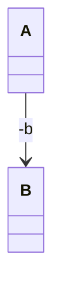
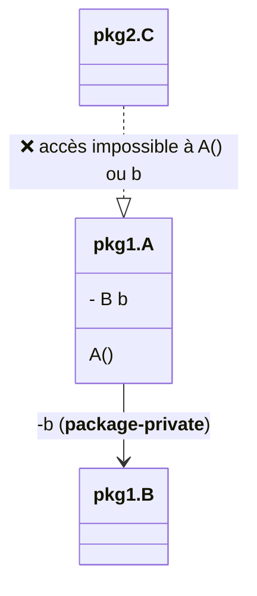
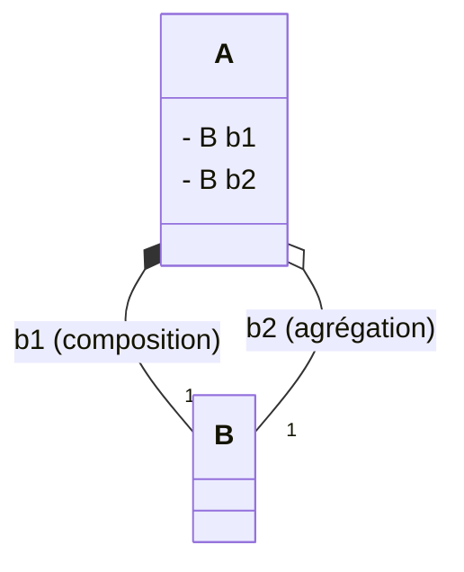
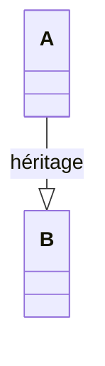
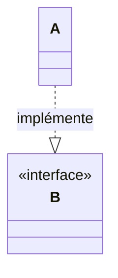
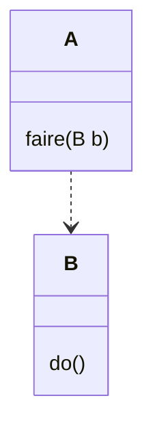
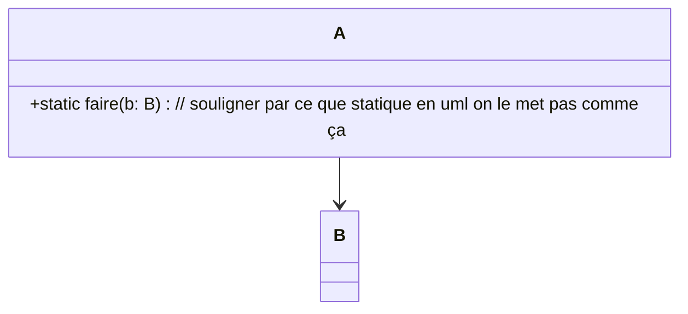

# Ce que on peut s'attendre du cours :
- apprendre les bases du java 
- la portée : tous ce qui est dévloppable dans un autres language objet est dévloppable 
- comment es ce que je fais pour coder propremement (orienté java / programmation orienté objet)
- voir de la qualité de code/conception 
- comprendre/maitriser UML

##  CM1 : voir (voir Annexe 3.1)

# TD1 : 

Ile st plus intelligent d ecapturer les informations, annalyser la situation puis prévoir au lieu de coder tete baisser.  

### Les bases : 


#### schéma 1 : **Association entre classes**



> **code :**  

```java 
public class A {
    private B b;

    public A() {]}
}

public class B {
    
}
```


#### schéma 2 : **Visibilité par défaut en Java**

> **À retenir** :  
> - Si on **n'indique pas** de modificateur (`public`, `protected`, `private`), la visibilité est dite :  
>   **`package-private`** (ou **défaut**)
> - **Seuls** les membres du **même package** peuvent accéder à la classe ou à ses membres  
> - **Extérieur au package** = **accès impossible**  

---

> **Contexte:**

- Les classes **`A`** et **`B`** sont dans le package **`pkg1`**
- La classe **`C`** est dans le package **`pkg2`**
- **`C` ne peut pas accéder** aux membres **`package-private`** de **`A`** ou **`B`**



> **Expliquation:**

- **`A`** : champ **`b`** et constructeur, **visibles UNIQUEMENT** depuis **`pkg1`** (*`package-private`*)
- **`B`** : aussi dans **`pkg1`**
- **`C`** : dans un **autre package** (**`pkg2`**)  
    👉 **ne peut NI créer d’instance de `A` NI accéder à ses membres `package-private`**

#### schéma 3 : Composition et Agrégation



> **Explication :**

- La classe **`A`** a deux champs, **`b1`** et **`b2`**, qui sont de type **`B`**.
- Il existe deux types de liens entre **`A`** et **`B`** :
    - **Composition** (**b1**) : **`A`** contient un **`B`** nommé **`b1`**. Si **`A`** est supprimée, **`b1`** l'est aussi.
    - **Agrégation** (**b2**) : **`A`** fait référence à un **`B`** nommé **`b2`**, mais ne gère pas sa durée de vie. Si **`A`** disparaît, **`b2`** peut rester.
- À retenir :
    - **Composition** : relation forte, **`B`** ne peut pas exister sans **`A`**
    - **Agrégation** : relation plus souple, **`B`** peut exister sans **`A`**

Ces concepts servent à représenter les relations entre objets en programmation.

> **code :**  

```java
class B { }

class A {
    B b1; 
    B b2; 

    A() {
        this.b1 = new B(); //<-- composition
        // agrégation : b2 assigné extérieur
    }
}
```

#### schéma 4 : Héritage (`extends`)



> **Explication :**

- La classe **`A`** **hérite** de la classe **`B`** grâce au mot-clé **`extends`**.
- Cela signifie que **`A`** récupère toutes les propriétés et méthodes **publiques et protégées** de **`B`**.
- On parle de **relation "est-un"** (*"is-a"*) : **`A`** est une sorte de **`B`**.

> **Code :**  

```java
class B { }

class A extends B { }
```


#### schéma 5 : Héritage (`implement `)



> **Explication:**

- La classe **`A`** **implémente** l'**interface** **`B`** grâce au mot-clé **`implements`**.
- Cela signifie que **`A`** s'engage à fournir une implémentation de toutes les méthodes déclarées dans l'interface **`B`**.
- On parle de **relation "est-un"** au sens contractuel : **`A`** se comporte comme un **`B`**.

> **Code :**  

```java
interface B { }

class A implements B { }
```

#### schéma 6 : Utilisation d'un objet en paramètre (dépendance)



> **Explication :**

- La classe **`A`** dépend de la classe **`B`** car elle utilise un objet de type **`B`** en paramètre de méthode.
- Cela signifie que **`A`** attend une **collaboration** ou une **dépendance** avec **`B`** pour effectuer une action.
- La flèche en pointillé matérialise une **dépendance** (utilisation ponctuelle, dans une méthode).

> **Code :**  

```java
public class B {
    void do() {}
}

public class A {
    void faire(B b) {
        b.do();
    }
}
```

#### schéma 7 : Utilisation d'un objet en paramètre (dépendance) avec méthode statique

> ### Voir Annexe 3.2

  

> **Explication :**

- La méthode **`faire(B b)`** est ici **statique** dans la classe **`A`** (ce que signale l'opérateur **`+static`**).
- On peut l'appeler sans créer d'objet **`A`** : **`A.faire(bInstance)`**.
- Cela reste une **dépendance** ponctuelle, ici réalisée via une méthode statique.

> **Code :**  

```java
public class B {
    void do() {}
}

public class A {
    static void faire(B b) {
        b.do();
    }
  
}
```

#### schéma 8 : Association via une Map avec clé de type `C`

Supposons que nous voulons associer des objets de type `B` à des clés de type `C` dans la classe `A`, en utilisant une Map.

> **Voire Schéma sur l'annexe 3.2**

> **Code :**

```java
import java.util.Map;

public class C {
}

public class B {
}

public class A {
    private Collection<Map<C, B>> b;

    public A(Collection<Map<C, B>> b) {
        this.b = b;
    }

}
```

> **Explication :**
- La classe **`A`** contient une **Map**<C, B> qui associe chaque objet `C` à un objet `B`.
- On peut ajouter ou récupérer des objets `B` à partir d'une clé `C`.
- Cela modélise une **association via une table de correspondance** (tableau associatif / map).


### Les conventions les plus importantes en Java

- **Nom de package** : toujours en minuscules, souvent basé sur le nom de domaine inversé (ex : `com.monsite.monprojet`)
- **Nom de classe** : chaque mot commence par une majuscule (CamelCase), ex : `MaClasseExemple`
- **Nom de méthode et de variable** : commence par une minuscule, puis CamelCase (ex : `maVariable`, `faireOperation()`)   

- **Constantes** : tout en majuscules, avec des underscores pour séparer les mots (ex : `VALEUR_PAR_DEFAUT`)

- **Indentation** : 4 espaces par niveau d'imbrication (pas de tabulations)

- **Fichier source** : un seul public class par fichier, et le fichier porte le nom de la classe publique

- **Bonne lisibilité** : commentaires clairs, pas de lignes trop longues, laisser des espaces entre les méthodes

- **Utilisation des modificateurs d'accès** : toujours préciser `public`, `private` ou `protected` selon le besoin

Ces conventions sont essentielles pour faciliter la lecture, la maintenance et la collaboration dans les projets Java.

### Quelque information importante 
>- <span style="color:#e74c3c"><b>Incompatibilité de types</b></span> ou conversions implicites/sous-entendues (ex: int vs float)
>- <span style="color:#d35400"><b>Gestion manuelle de la mémoire</b></span> (allocation/libération, ex: en C)
>- <span style="color:#f1c40f"><b>Erreurs de compilation obscures</b></span>
>- <span style="color:#27ae60"><b>Encodage des caractères</b></span> et problèmes d'<b>unicode</b>
>- <span style="color:#2980b9"><b>Collections</b></span> qui ne supportent pas les <b>types primitifs</b> (ex: Java)
>- <span style="color:#8e44ad"><b>Conflits de noms</b></span> (variables, fonctions) et gestion des <b>espaces de nom</b> (namespace, package, import)
>- <span style="color:#e67e22"><b>Changements de conventions de nommage ou de syntaxe</b></span> entre langages (camelCase, snake_case, etc.)
>- <span style="color:#16a085"><b>Problèmes d'installation de dépendances</b></span> ou de gestion de <b>versions de bibliothèques</b>
>- <span style="color:#34495e"><b>Différences dans la gestion des exceptions/erreurs</b></span> (try/catch, checked/unchecked)
>- <span style="color:#c0392b"><b>Problèmes de portée</b></span> (scope) et de durée de vie des variables

#### <span style="color:#2980b9">L'utilisation de <code>@Override</code> en Java</span>

<span style="color:#2ecc71"><b>L'annotation <code>@Override</code></b></span> est utilisée en Java pour indiquer qu'une méthode est censée redéfinir (ou "override") une méthode d'une classe parente ou d'une interface implémentée.

<span style="color:#e67e22"><b>Pourquoi l'utiliser ?</b></span>
<ul>
  <li>Elle permet au <span style="color:#c0392b"><b>compilateur</b></span> de vérifier que vous redéfinissez effectivement une méthode existante (et donc d'éviter certaines erreurs d'inattention sur le nom, la signature ou les paramètres).</li>
  <li>Elle rend le code plus <span style="color:#9b59b6"><b>lisible</b></span> pour les autres développeurs, en indiquant clairement que la méthode modifie un comportement hérité.</li>
</ul>

<span style="color:#16a085"><b>Exemple :</b></span>
```java
class Animal {
    void parler() {
        System.out.println("L'animal fait du bruit");
    }
}

class Chien extends Animal {
    @Override
    void parler() {
        System.out.println("Le chien aboie");
    }
}
```

<div style="color:#e74c3c">
Dans cet exemple, la méthode <code>parler()</code> de <b>Chien</b> redéfinit celle de <b>Animal</b>. Si vous vous trompez dans le nom ou la signature, le compilateur affichera une erreur grâce à <code>@Override</code>.
</div>

<span style="color:#f1c40f"><b>Bonnes pratiques :</b></span>
<ul>
  <li>Toujours utiliser <code>@Override</code> lorsque vous redéfinissez une méthode héritée ou implémentée.</li>
</ul>


## Exercice 

### Contexte : 
> Concevoir et devlopper une application client qui permet à un medecin de saisir des nouveaux patient et d'afficher la liste de ces patients 


# Tp 3 :

## Serialization 

- nécessaire d'implémenter une interface de serialization  
- pour ensuite manipuler les objets sérializer il est nécessaire d'utiliser **ObjectOutputStream** et **ObjectInputStream**

<span style="color:#FF0000"> **exemple de sérialization :** </span>

>```java 
>public class Person implements Serializable {
>    private static final long serialVersionUID = 1L;
>
>    private String name;
>    private int age;
>    private transient String password; // non sérialisé
>}
>```

<span style="color:#FF0000">**sérializer vers un fichier :**</span>  
>```java
>    try{
>        final FileOutputStream fichier = new FileOutputStream("personne.ser");
>        oos = new ObjectOutputStream(fichier);
>        oos.writeObject(personne);
>        oos.flush();
>    } catch (final java.io.IOException e) {
>        e.printStackTrace();
>    }
>```


# Annexe : 
## Reference : 
- Martin Fowler (pour voir la theorie d'UML)


