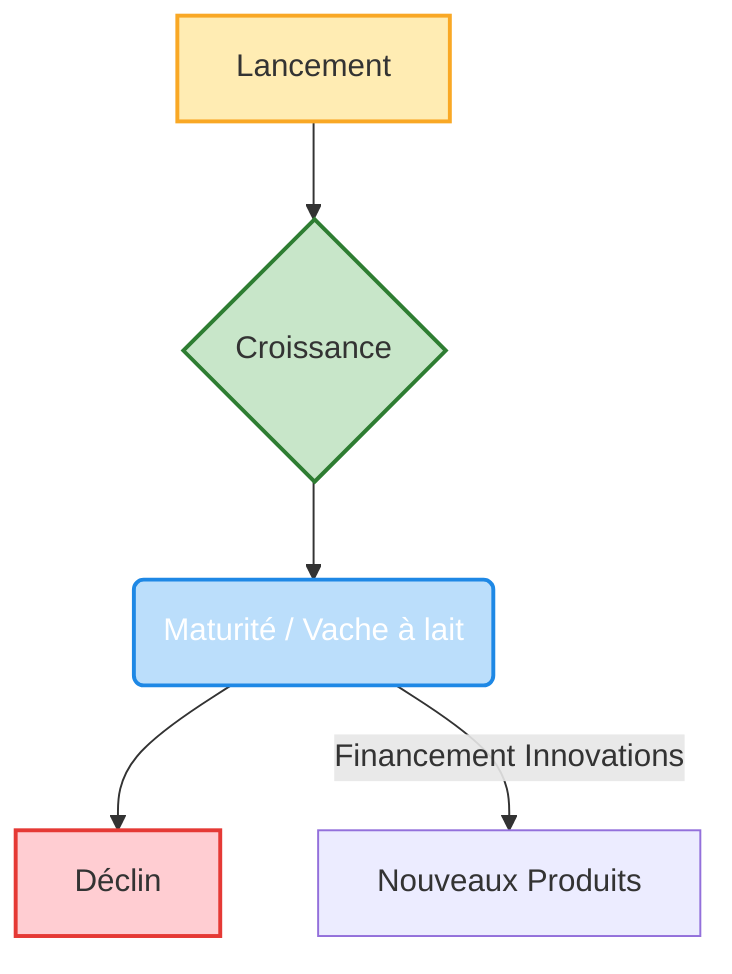

# Inovation 

## Pourquoi Innover

Afin d'éviter d'avoir un marché Saturé (il devient Océan Rouge = profitabilité quasi null donc pas intéressant)

## La courbe de vie des « vaches à lait »

En innovation et en gestion de portefeuille de produits, on parle souvent des « vaches à lait » (Cash Cows) selon la matrice BCG. Ce sont des produits ou activités qui génèrent beaucoup de liquidités grâce à leur position dominante sur un marché mature, mais dont la croissance est faible. Ces produits financent souvent l’innovation et le développement de nouveaux produits.

Voici une représentation schématique de la courbe de vie d’une « vache à lait » :

## L'innovation : un dilemme pour le manager

L’innovation est essentielle à la pérennité et à la croissance d’une entreprise, mais elle représente aussi un véritable dilemme pour le manager. En effet, il s’agit de trouver le juste équilibre entre l’exploitation des activités existantes (qui génèrent des revenus stables) et l’exploration de nouvelles opportunités (qui comportent des risques mais sont sources de croissance future).

### Le dilemme de l’explorateur et de l’exploitant

- **Exploitation** : Optimiser, améliorer et rentabiliser les produits, services ou processus déjà en place. Cela permet de sécuriser les revenus à court terme, mais peut conduire à une forme d’immobilisme si l’on néglige l’innovation.
- **Exploration** : Investir dans la recherche, le développement de nouveaux produits, services ou modèles d’affaires. Cela implique de prendre des risques, d’accepter l’incertitude et parfois l’échec, mais c’est indispensable pour rester compétitif à long terme.

### Les risques du non-choix

Un manager qui se concentre uniquement sur l’exploitation risque de voir son entreprise décliner face à la concurrence ou à l’évolution du marché (phénomène de disruption). À l’inverse, une focalisation excessive sur l’innovation peut fragiliser la rentabilité et la stabilité financière de l’entreprise.

### Les leviers pour gérer ce dilemme

- **Allouer des ressources dédiées à l’innovation** (ex : équipes, budgets, temps)
- **Mettre en place une culture de l’expérimentation** et accepter l’échec comme source d’apprentissage
- **Favoriser la collaboration entre les équipes “exploitantes” et “exploratrices”**
- **Définir une stratégie d’innovation claire** alignée avec la vision de l’entreprise

### À retenir

Le rôle du manager de l’innovation est donc de piloter ce double mouvement : exploiter le présent tout en préparant l’avenir. Il doit savoir arbitrer, encourager la prise d’initiative, et créer un environnement propice à l’émergence de nouvelles idées tout en assurant la performance opérationnelle de l’entreprise.

### Valeur Perçue 

La valeur perçue d’un produit ne se limite pas à ses caractéristiques techniques ou à son prix : elle dépend aussi de l’image que le produit renvoie et de la façon dont il s’inscrit dans l’univers de l’entreprise. L’image de marque, le design, la communication et l’expérience globale associée au produit jouent un rôle essentiel dans la perception qu’en ont les clients.

On distingue plusieurs dimensions de la valeur perçue :

- **La valeur d’usage** : c’est l’utilité concrète du produit, sa capacité à répondre à un besoin fonctionnel ou à résoudre un problème pour l’utilisateur.
- **La valeur hédonique** : elle correspond au plaisir, à l’émotion ou à la satisfaction sensorielle que procure le produit. Cela peut passer par le design, l’ergonomie, le prestige ou le sentiment d’appartenance à une communauté.
- **La valeur d’image** : le produit véhicule une image, des valeurs ou un style de vie qui peuvent renforcer l’identité de l’acheteur ou lui permettre de se différencier.

Pour le manager, il est donc crucial de travailler à la fois sur la performance d’usage du produit, sur l’expérience émotionnelle qu’il procure et sur l’image qu’il projette, afin de maximiser la valeur perçue et la préférence des clients.

