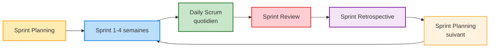

# Cours de Méthodes Agiles

# Méthode Scrum

## Trois grands rôles principaux 

<strong>Product Owner</strong> : Définit les exigences et priorités et représente le client dans le projet (Tuteur)

- **Vision du produit** : Porte la vision globale et s’assure que chaque fonctionnalité a du sens.
- **Gestion du Product Backlog** : Tient à jour et priorise la liste des tâches (backlog voir exemple ⬇️) selon la valeur pour le client.
- **Interface parties prenantes** : Recueille les besoins et communique avec clients et équipe.
- **Validation** : Accepte ou refuse les livrables à chaque sprint.
- **Décisions rapides** : Répond vite aux questions et fixe les priorités.
- **Maximisation de la valeur** : Oriente l’équipe sur ce qui apporte le plus de valeur.

<strong>Équipe de Développement</strong> : L’équipe de développement est composée de professionnels qui réalisent le travail technique nécessaire pour livrer les incréments du produit à chaque sprint. Elle est auto-organisée, pluridisciplinaire et responsable de la qualité des livrables. Ses principales responsabilités sont :

- **Polyvalence et multitâche** : Chaque membre peut intervenir sur plusieurs aspects du projet (développement, tests, documentation, etc.), favorisant la flexibilité et la réactivité de l’équipe.
- **Développer et tester** : Transformer le backlog en fonctionnalités prêtes à l’emploi.
- **S’auto-organiser** : Choisir ensemble comment atteindre les objectifs du sprint.
- **Collaborer** : Partager l’info, s’entraider, bien communiquer.
- **S’améliorer** : Identifier et appliquer des axes de progrès à chaque rétrospective.
- **Assurer la qualité** : Garantir un code fiable et bien documenté à chaque itération.

<strong>Scrum Master</strong> : Garant du cadre Scrum, il accompagne l’équipe et s’assure du respect des pratiques agiles (Membre de la SAE).

- **Facilitateur** : Organise et anime les cérémonies Scrum (Daily, Sprint Planning, Review, Rétrospective).
- **Suppression des obstacles** : Aide l’équipe à identifier et lever les blocages.
- **Coach agile** : Accompagne l’équipe dans l’adoption et l’amélioration continue des pratiques agiles.
- **Protection de l’équipe** : Protège l’équipe des interruptions extérieures et veille à un environnement de travail sain.
- **Médiateur** : Favorise la communication et la résolution des conflits au sein de l’équipe.
- **Transmission de la culture agile** : Sensibilise l’équipe et les parties prenantes à l’esprit et aux valeurs agiles.

## Cycle des Sprints

### Description des Phases (événements) 

**Sprint Planning** : Planification du sprint, sélection des tâches du Product Backlog et estimation du travail.
Tache que l'on rentre généralement dans un Kanban. (voir exemple de Kanban ⬇️)

**Sprint (1-4 semaines)** : Période de développement où l'équipe travaille sur les tâches sélectionnées (userStory pour coller au cours).

**Daily Meeting**  
Réunion quotidienne de 15 minutes pour synchroniser l'équipe et identifier les obstacles.  
Constituée d'une réponse de chaque membre de l'équipe : 
1. Qu'ai-je fait hier ?
2. Que vais-je faire aujourd'hui ?
3. Ai-je rencontré des obstacles ou des problèmes ?

**Sprint Review** : Démonstration du travail accompli aux parties prenantes et collecte des retours.

**Sprint Retrospective** : Réflexion sur le processus pour identifier les améliorations à apporter.
Question courante : 
- Qu'est-ce qui a bien fonctionné pendant ce sprint ?
- Qu'est-ce qui aurait pu mieux se passer ?
- Quels obstacles avons-nous rencontrés et comment les avons-nous surmontés (ou pas) ?
- Que pouvons-nous améliorer pour le prochain sprint ?
- Avons-nous respecté nos engagements et nos processus ?
- Y a-t-il des points de friction ou des tensions dans l'équipe ?
- Quelles actions concrètes allons-nous mettre en place pour progresser ?

**Sprint Planning suivant** : Retour au début du cycle pour planifier le prochain sprint.

## Les Artefacts
Légende Kanban : À faire • En cours • Terminé
> ### Exemple de tableau Kanban
> 
> | À faire                | En cours                | Terminé                |
> |------------------------|-------------------------|------------------------|
> | Rédiger la user story  | Développer la feature X | Corriger le bug Y      |
> | Préparer la réunion    | Écrire les tests unitaires | Mettre à jour la documentation |
> | Concevoir la maquette  |                         |                        |
> 
> Chaque colonne représente un état d’avancement des tâches. Les tâches passent de « À faire » à « En cours » puis à « Terminé » au fil du sprint.

> ### Exemple de Product Backlog
>
> | Priorité | Utilisateur    | Fonctionnalité                                 | Estimation (points) | Statut   |
> |----------|----------------|------------------------------------------------|---------------------|----------|
> | 1        | Utilisateur    | Inscription à la plateforme                    | 5                   | À faire  |
> | 2        | Utilisateur    | Connexion à son compte                         | 3                   | À faire  |
> | 3        | Utilisateur    | Réinitialisation du mot de passe               | 2                   | À faire  |
> | 4        | Utilisateur    | Modification des informations du profil        | 5                   | À faire  |
> | 5        | Administrateur | Visualisation de la liste des utilisateurs     | 3                   | À faire  |
>
>L'estimation en points correspond au niveau de difficulté estimé  par l'équipe pour une tache donné (définit par exemple avec me scrum poker)

## Déroulement d'un cycle scrum 
Voici le déroulement typique d’un cycle Scrum, en mettant l’accent sur le rôle du Product Owner (PO) qui rédige et priorise le Product Backlog :

1. **Rédaction et priorisation du Product Backlog**  
   Le Product Owner (PO) recueille les besoins des parties prenantes et rédige les user stories dans le Product Backlog. Il les priorise en fonction de la valeur métier, des risques et des dépendances.

2. **Sprint Planning**  
   L’équipe Scrum (PO, Scrum Master, Développeurs) se réunit pour sélectionner les éléments du Product Backlog à réaliser pendant le sprint. Le PO explique les user stories et répond aux questions de l’équipe.

3. **Déroulement du Sprint**  
   L’équipe de développement travaille sur les tâches sélectionnées. Le PO reste disponible pour clarifier les besoins et ajuster les priorités si nécessaire.

4. **Daily Meeting (Scrum quotidien)**  
   Chaque jour, l’équipe se synchronise lors d’une courte réunion. Le PO peut y assister pour écouter les avancées et les éventuels blocages, mais il n’intervient pas dans la planification technique.

5. **Sprint Review**  
   À la fin du sprint, l’équipe présente les fonctionnalités terminées au PO et aux parties prenantes. Le PO valide ou refuse les livrables selon les critères d’acceptation.

6. **Sprint Retrospective**  
   L’équipe (avec ou sans le PO) analyse le déroulement du sprint pour identifier des axes d’amélioration.

7. **Mise à jour du Product Backlog**  
   Le PO intègre les retours de la Sprint Review et de la Retrospective pour ajuster et enrichir le Product Backlog, préparant ainsi le prochain cycle.

Ce cycle se répète à chaque sprint, permettant une amélioration continue du produit et du processus.

## La User Story

La **User Story** (ou « histoire utilisateur ») est un outil clé des méthodes agiles pour exprimer un besoin du point de vue de l’utilisateur. Voici les points principaux à retenir :

- **Définition** :  
  Une User Story décrit une fonctionnalité ou un besoin sous forme simple, centrée sur l’utilisateur ou le client.

- **Structure type** :  
  > <strong>En tant que</strong> [utilisateur]  
  > <strong>Je veux</strong> [action]  
  > <strong>Afin de</strong> [objectif]

  *Exemple :*
  > En tant qu’**utilisateur**,  
  > Je veux **pouvoir réinitialiser mon mot de passe**,  
  > Afin de **récupérer l’accès à mon compte en cas d’oubli**.

- **Critères INVEST** :  
  Une bonne User Story doit être :
  - <strong>I</strong>ndépendante
  - <strong>N</strong>égociable
  - <strong>V</strong>aleur métier claire
  - <strong>E</strong>stimable
  - <strong>S</strong>imple (petite)
  - <strong>T</strong>estable

- **Critères d’acceptation** :  
  Chaque User Story doit être accompagnée de critères d’acceptation précis, qui définissent quand la story est considérée comme terminée.

  *Exemple :*
  - ✅ L’utilisateur reçoit un email de réinitialisation.
  - ✅ Le lien de réinitialisation expire après 24h.
  - ⚠️ Un message d’erreur s’affiche si l’email n’est pas reconnu.

- **Avantages** :  
  - Favorise la communication et la compréhension des besoins.
  - Permet de prioriser et d’estimer facilement les tâches.
  - Facilite l’adaptation aux changements.

- **Bonnes pratiques** :  
  - Rédiger les User Stories en collaboration avec l’équipe et le Product Owner.
  - Ajouter des exemples et des critères d’acceptation clairs.
  - Découper les stories trop grandes en stories plus petites.

En résumé, la User Story est un outil simple et puissant pour exprimer les besoins fonctionnels, guider le développement et assurer la satisfaction des utilisateurs.

###  Epic Story 

Une **Epic Story** (ou simplement « Epic ») est une User Story de grande taille, souvent trop vaste pour être réalisée en un seul sprint. Elle regroupe plusieurs User Stories plus petites et permet de structurer des besoins complexes ou des fonctionnalités majeures. Les Epics sont découpées progressivement en stories plus détaillées au fil de l’avancement du projet.
