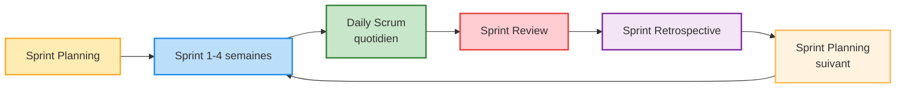
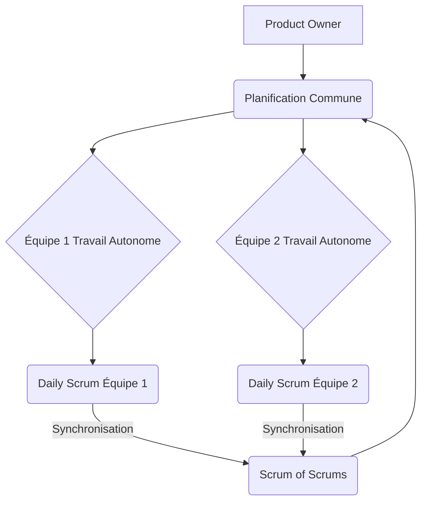

# Cours de Méthodes Agiles

# Méthode Scrum

## Trois grands rôles principaux 

<strong>Product Owner</strong> : Définit les exigences et priorités et représente le client dans le projet (Tuteur)

- **Vision du produit** : Porte la vision globale et s’assure que chaque fonctionnalité a du sens.
- **Gestion du Product Backlog** : Tient à jour et priorise la liste des tâches (backlog voir exemple ⬇️) selon la valeur pour le client.
- **Interface parties prenantes** : Recueille les besoins et communique avec clients et équipe.
- **Validation** : Accepte ou refuse les livrables à chaque sprint.
- **Décisions rapides** : Répond vite aux questions et fixe les priorités.
- **Maximisation de la valeur** : Oriente l’équipe sur ce qui apporte le plus de valeur.

<strong>Équipe de Développement</strong> : L’équipe de développement est composée de professionnels qui réalisent le travail technique nécessaire pour livrer les incréments du produit à chaque sprint. Elle est auto-organisée, pluridisciplinaire et responsable de la qualité des livrables. Ses principales responsabilités sont :

- **Polyvalence et multitâche** : Chaque membre peut intervenir sur plusieurs aspects du projet (développement, tests, documentation, etc.), favorisant la flexibilité et la réactivité de l’équipe.
- **Développer et tester** : Transformer le backlog en fonctionnalités prêtes à l’emploi.
- **S’auto-organiser** : Choisir ensemble comment atteindre les objectifs du sprint.
- **Collaborer** : Partager l’info, s’entraider, bien communiquer.
- **S’améliorer** : Identifier et appliquer des axes de progrès à chaque rétrospective.
- **Assurer la qualité** : Garantir un code fiable et bien documenté à chaque itération.

<strong>Scrum Master</strong> : Garant du cadre Scrum, il accompagne l’équipe et s’assure du respect des pratiques agiles (Membre de la SAE).

- **Facilitateur** : Organise et anime les cérémonies Scrum (Daily, Sprint Planning, Review, Rétrospective).
- **Suppression des obstacles** : Aide l’équipe à identifier et lever les blocages.
- **Coach agile** : Accompagne l’équipe dans l’adoption et l’amélioration continue des pratiques agiles.
- **Protection de l’équipe** : Protège l’équipe des interruptions extérieures et veille à un environnement de travail sain.
- **Médiateur** : Favorise la communication et la résolution des conflits au sein de l’équipe.
- **Transmission de la culture agile** : Sensibilise l’équipe et les parties prenantes à l’esprit et aux valeurs agiles.

## Cycle des Sprints

### Description des Phases (événements) 

**Sprint Planning** : Planification du sprint, sélection des tâches du Product Backlog et estimation du travail.
Tache que l'on rentre généralement dans un Kanban. (voir exemple de Kanban ⬇️)

**Sprint (1-4 semaines)** : Période de développement où l'équipe travaille sur les tâches sélectionnées (userStory pour coller au cours).

**Daily Meeting**  
Réunion quotidienne de 15 minutes pour synchroniser l'équipe et identifier les obstacles.  
Constituée d'une réponse de chaque membre de l'équipe : 
1. Qu'ai-je fait hier ?
2. Que vais-je faire aujourd'hui ?
3. Ai-je rencontré des obstacles ou des problèmes ?

**Sprint Review** : Démonstration du travail accompli aux parties prenantes et collecte des retours.

**Sprint Retrospective** : Réflexion sur le processus pour identifier les améliorations à apporter.
Question courante : 
- Qu'est-ce qui a bien fonctionné pendant ce sprint ?
- Qu'est-ce qui aurait pu mieux se passer ?
- Quels obstacles avons-nous rencontrés et comment les avons-nous surmontés (ou pas) ?
- Que pouvons-nous améliorer pour le prochain sprint ?
- Avons-nous respecté nos engagements et nos processus ?
- Y a-t-il des points de friction ou des tensions dans l'équipe ?
- Quelles actions concrètes allons-nous mettre en place pour progresser ?

**Sprint Planning suivant** : Retour au début du cycle pour planifier le prochain sprint.

## Les Artefacts
Légende Kanban : À faire • En cours • Terminé
> ### Exemple de tableau Kanban
> 
> | À faire                | En cours                | Terminé                |
> |------------------------|-------------------------|------------------------|
> | Rédiger la user story  | Développer la feature X | Corriger le bug Y      |
> | Préparer la réunion    | Écrire les tests unitaires | Mettre à jour la documentation |
> | Concevoir la maquette  |                         |                        |
> 
> Chaque colonne représente un état d’avancement des tâches. Les tâches passent de « À faire » à « En cours » puis à « Terminé » au fil du sprint.

> ### Exemple de Product Backlog
>
> | Priorité | Utilisateur    | Fonctionnalité                                 | Estimation (points) | Statut   |
> |----------|----------------|------------------------------------------------|---------------------|----------|
> | 1        | Utilisateur    | Inscription à la plateforme                    | 5                   | À faire  |
> | 2        | Utilisateur    | Connexion à son compte                         | 3                   | À faire  |
> | 3        | Utilisateur    | Réinitialisation du mot de passe               | 2                   | À faire  |
> | 4        | Utilisateur    | Modification des informations du profil        | 5                   | À faire  |
> | 5        | Administrateur | Visualisation de la liste des utilisateurs     | 3                   | À faire  |
>
>L'estimation en points correspond au niveau de difficulté estimé  par l'équipe pour une tache donné (définit par exemple avec me scrum poker)

## Déroulement d'un cycle scrum 
Voici le déroulement typique d’un cycle Scrum, en mettant l’accent sur le rôle du Product Owner (PO) qui rédige et priorise le Product Backlog :

1. **Rédaction et priorisation du Product Backlog**  
   Le Product Owner (PO) recueille les besoins des parties prenantes et rédige les user stories dans le Product Backlog. Il les priorise en fonction de la valeur métier, des risques et des dépendances.

2. **Sprint Planning**  
   L’équipe Scrum (PO, Scrum Master, Développeurs) se réunit pour sélectionner les éléments du Product Backlog à réaliser pendant le sprint. Le PO explique les user stories et répond aux questions de l’équipe.

3. **Déroulement du Sprint**  
   L’équipe de développement travaille sur les tâches sélectionnées. Le PO reste disponible pour clarifier les besoins et ajuster les priorités si nécessaire.

4. **Daily Meeting (Scrum quotidien)**  
   Chaque jour, l’équipe se synchronise lors d’une courte réunion. Le PO peut y assister pour écouter les avancées et les éventuels blocages, mais il n’intervient pas dans la planification technique.

5. **Sprint Review**  
   À la fin du sprint, l’équipe présente les fonctionnalités terminées au PO et aux parties prenantes. Le PO valide ou refuse les livrables selon les critères d’acceptation.

6. **Sprint Retrospective**  
   L’équipe (avec ou sans le PO) analyse le déroulement du sprint pour identifier des axes d’amélioration.

7. **Mise à jour du Product Backlog**  
   Le PO intègre les retours de la Sprint Review et de la Retrospective pour ajuster et enrichir le Product Backlog, préparant ainsi le prochain cycle.

Ce cycle se répète à chaque sprint, permettant une amélioration continue du produit et du processus.

## La User Story

La **User Story** (ou « histoire utilisateur ») est un outil clé des méthodes agiles pour exprimer un besoin du point de vue de l’utilisateur. Voici les points principaux à retenir :

- **Définition** :  
  Une User Story décrit une fonctionnalité ou un besoin sous forme simple, centrée sur l’utilisateur ou le client.

- **Structure type** :  
  > <strong>En tant que</strong> [utilisateur]  
  > <strong>Je veux</strong> [action]  
  > <strong>Afin de</strong> [objectif]

  *Exemple :*
  > En tant qu’**utilisateur**,  
  > Je veux **pouvoir réinitialiser mon mot de passe**,  
  > Afin de **récupérer l’accès à mon compte en cas d’oubli**.

- **Critères INVEST** :  
  Une bonne User Story doit être :
  - <strong>I</strong>ndépendante
  - <strong>N</strong>égociable
  - <strong>V</strong>aleur métier claire
  - <strong>E</strong>stimable
  - <strong>S</strong>imple (petite)
  - <strong>T</strong>estable

- **Critères d’acceptation** :  
  Chaque User Story doit être accompagnée de critères d’acceptation précis, qui définissent quand la story est considérée comme terminée.

  *Exemple :*
  - ✅ L’utilisateur reçoit un email de réinitialisation.
  - ✅ Le lien de réinitialisation expire après 24h.
  - ⚠️ Un message d’erreur s’affiche si l’email n’est pas reconnu.

- **Avantages** :  
  - Favorise la communication et la compréhension des besoins.
  - Permet de prioriser et d’estimer facilement les tâches.
  - Facilite l’adaptation aux changements.

- **Bonnes pratiques** :  
  - Rédiger les User Stories en collaboration avec l’équipe et le Product Owner.
  - Ajouter des exemples et des critères d’acceptation clairs.
  - Découper les stories trop grandes en stories plus petites.

En résumé, la User Story est un outil simple et puissant pour exprimer les besoins fonctionnels, guider le développement et assurer la satisfaction des utilisateurs.

###  Epic Story 

Une **Epic Story** (ou simplement « Epic ») est une User Story de grande taille, souvent trop vaste pour être réalisée en un seul sprint. Elle regroupe plusieurs User Stories plus petites et permet de structurer des besoins complexes ou des fonctionnalités majeures. Les Epics sont découpées progressivement en stories plus détaillées au fil de l’avancement du projet.

### Rétropective de sprint 

Afin de mener à bien la rétrospective de sprint, il existe plusieurs méthodes, dont :

- la méthode <strong>Keep Drop Start</strong> :  
  Cette méthode consiste à structurer la rétrospective autour de trois axes :
  - <strong>Keep</strong> : Identifier ce que l’équipe souhaite conserver, c’est-à-dire les pratiques ou éléments qui ont bien fonctionné durant le sprint.
  - <strong>Drop</strong> : Déterminer ce qu’il faut arrêter de faire, c’est-à-dire les actions, comportements ou processus qui n’ont pas apporté de valeur ou ont posé problème.
  - <strong>Start</strong> : Proposer de nouvelles actions ou expérimentations à mettre en place pour améliorer le prochain sprint.

  Cette approche simple et visuelle favorise la participation de tous et permet de cibler rapidement les axes d’amélioration. Pour les actions a mener il est nécessaire d'attibuer 3 points à chacun. Les post it avec le plus de point sont retenus.

- la méthode <strong>Variante</strong> :  
  Cette méthode propose d’aborder la rétrospective à travers plusieurs axes originaux et complémentaires :

  - <strong>✅ Qu’est-ce qui a bien marché ?</strong>  
    Identifier les points positifs et les succès du sprint.

  - <strong>🔜 Que faut-il faire lors du prochain sprint ?</strong>  
    Définir les actions à entreprendre ou à améliorer pour la prochaine itération.

  - <strong>💡 Qu’ai-je appris ?</strong>  
    Partager les apprentissages, découvertes ou nouvelles compétences acquises.

  - <strong>❓ Qu’est-ce qui est mal compris ou doit être clarifié pour la suite ?</strong>  
    Mettre en avant les zones d’ombre, incompréhensions ou points à éclaircir.

  - <strong>😤 Qu’est-ce qui m’a rendu fou ?</strong>  
    Exprimer les frustrations, irritations ou obstacles rencontrés.

  - <strong>😂 Qu’est-ce qui m’a fait rire ?</strong>  
    Partager les moments de bonne humeur ou anecdotes amusantes du sprint.

  Cette variante permet d’aborder la rétrospective de façon plus humaine et ludique, tout en favorisant l’expression de chacun et la cohésion de l’équipe.

  On peut également poursuivre avec la méthode en étoile, qui consiste à organiser la rétrospective autour de catégories disposées en étoile, telles que :
   - Continuer à ...
   - Faire plus de ...
   - Commencer à ...
   - Faire moins de ...
   - Arrêter de ...

  Cette présentation visuelle facilite la réflexion collective et permet à chaque membre de l’équipe de s’exprimer sur différents axes d’amélioration.

### Les contradictions 
- <strong>Contrat simple en agile</strong>  
  <strong>Pour :</strong>
  - Grande flexibilité pour adapter le périmètre en fonction des besoins réels du client.
  - Favorise la collaboration et la confiance entre l’équipe et le client.
  - Permet d’intégrer facilement les retours et changements en cours de projet.
  - Encourage la transparence et l’amélioration continue.
  
  <strong>Contre :</strong>
  - Difficulté à estimer précisément le budget et la durée du projet.
  - Risque de dérive du périmètre si les attentes ne sont pas bien cadrées.
  - Peut générer de l’incertitude pour le client sur le résultat final.
  - Nécessite une forte implication du client tout au long du projet.

- <strong>Contrat au forfait en agile</strong>  
  <strong>Pour :</strong>
  - Budget, délais et périmètre définis dès le départ, ce qui rassure le client.
  - Permet une planification plus précise des ressources et des livrables.
  - Offre un cadre contractuel clair pour les deux parties.
  - Peut convenir à des projets avec des exigences bien identifiées.

  <strong>Contre :</strong>
  - Moins de flexibilité pour intégrer des changements en cours de route.
  - Toute modification importante nécessite un avenant ou une renégociation.
  - L’agilité se limite souvent à la gestion interne de l’équipe.
  - Risque de tensions si le périmètre initial est mal défini ou sous-estimé.
- <strong>Contractualisation par sprint en agile</strong>  
  <strong>Pour :</strong>
  - Permet une adaptation très fine à l’évolution des besoins à chaque itération.
  - Engagement progressif : le client ne s’engage que pour un sprint à la fois.
  - Réduit les risques financiers et fonctionnels en limitant l’investissement à court terme.
  - Favorise la transparence sur l’avancement et la valeur livrée à chaque sprint.

  <strong>Contre :</strong>
  - Peut générer un sentiment d’incertitude sur la vision globale et la planification long terme.
  - Nécessite une forte implication continue du client pour valider et prioriser à chaque sprint.
  - Difficile d’obtenir des engagements fermes sur le budget total ou la date de livraison finale.
  - Peut être perçu comme un manque d’engagement réciproque sur la durée du projet.
  ### Que faire des user stories non livrées lors d’une facturation par sprint ?

  Lorsqu’on contractualise et facture au sprint, il arrive que certaines user stories prévues ne soient pas terminées à la fin de l’itération. La gestion de ces user stories non livrées doit être clarifiée dès le départ pour éviter tout malentendu entre le client et l’équipe.

  **Plusieurs options existent :**

  - <strong>Refacturation au sprint suivant</strong>  
    Les user stories non terminées sont reportées dans le backlog et intégrées au sprint suivant. Elles ne sont facturées que lorsqu’elles sont effectivement livrées et validées par le client.  
    Avantage : Le client ne paie que pour la valeur réellement livrée.  
    Inconvénient : Cela peut compliquer la gestion de la facturation et du suivi.

  - <strong>Facturation du sprint tel que réalisé</strong>  
    Le sprint est facturé dans son ensemble, même si toutes les user stories n’ont pas été livrées, car l’équipe a consacré le temps prévu.  
    Avantage : Simplicité de gestion et respect du cadre temporel.  
    Inconvénient : Le client peut avoir le sentiment de payer pour des fonctionnalités non livrées.

  - <strong>Partage du risque</strong>  
    Un compromis peut être trouvé : par exemple, seules les user stories terminées sont facturées, ou bien un pourcentage du sprint est retenu jusqu’à la livraison complète.  
    Avantage : Équilibre entre engagement de l’équipe et satisfaction du client.  
    Inconvénient : Cela nécessite une négociation et une contractualisation précise.

  **Qui prend en charge le coût des user stories non livrées ?**

  - <strong>L’équipe (le prestataire)</strong> prend en charge si le retard est dû à un problème d’organisation interne, de sous-estimation ou de blocage technique non anticipé.
  - <strong>Le client</strong> prend en charge si le retard est causé par un manque de disponibilité, des validations tardives ou des changements de priorités de sa part.
  - <strong>Cas mixte</strong> : souvent, la réalité est partagée et il est important de définir dans le contrat les cas de figure et la répartition des responsabilités.

  > **À retenir :**  
  <strong>La gestion des user stories non livrées doit être anticipée dans le contrat de facturation par sprint, pour garantir la transparence et la confiance entre les parties.</strong>

  ### Comment gérer les bugs et la non-validation des user stories

  La gestion des bugs et des user stories non validées est un point clé dans un projet agile, notamment en Scrum. Voici comment cela peut être abordé :

  **Bugs et defect stories :**
  - Les bugs identifiés pendant un sprint sont généralement ajoutés au backlog sous forme de « defect stories » et priorisés selon leur impact.
  - <strong>Si un bug (décrit alors comme une defect story) bloque la livraison d’une user story, il doit être corrigé avant la validation de celle-ci.</strong>
  - Les defect stories critiques peuvent être traitées immédiatement, tandis que les moins urgentes sont planifiées pour un sprint ultérieur.

  **User stories non validées :**
  - <strong>Une user story non validée à la fin du sprint (car incomplète ou ne répondant pas aux critères d’acceptation) n’est pas considérée comme « terminée ».</strong>
  - Elle retourne dans le backlog produit, est réévaluée et priorisée pour un prochain sprint.
  - La non-validation peut entraîner une discussion lors de la rétrospective pour comprendre les causes (sous-estimation, blocage, manque de clarté, etc.) et améliorer le processus.

  **À retenir :**
  - <strong>La transparence et la communication avec le client sont essentielles pour gérer ces situations.</strong>
  - Il est important de documenter les décisions prises et d’ajuster le contrat ou les attentes si nécessaire.

## Les différents type de contrat en methode scrum 

### Contrat à coût variable (ou « Time & Material »)

Dans ce type de contrat, le client s’engage à rémunérer l’équipe sur la base du <strong>temps effectivement passé</strong> et des <strong>ressources réellement mobilisées</strong>, plutôt que sur un périmètre fonctionnel figé à l’avance. L’équipe travaille pendant une période convenue (par exemple, un certain nombre de sprints ou de semaines), et le client paie pour le travail effectivement réalisé, généralement sur la base d’un tarif journalier ou horaire.

**Caractéristiques principales :**
- <strong>Flexibilité maximale</strong> : Le client peut ajuster les priorités, ajouter ou retirer des fonctionnalités au fil du projet, en fonction de l’avancement et des besoins réels.
- <strong>Transparence</strong> : Le suivi du temps passé et des livrables est régulier, souvent via des points d’avancement ou des démonstrations à la fin de chaque sprint.
- <strong>Engagement sur les moyens, pas sur le résultat</strong> : L’équipe s’engage à fournir ses efforts et son expertise, mais le périmètre exact du produit final peut évoluer.

**Avantages :**
- Adapté aux projets où les besoins sont susceptibles d’évoluer ou ne sont pas totalement définis au départ.
- Permet une grande réactivité face aux changements de contexte ou de priorités.
- Favorise la collaboration et la confiance entre le client et l’équipe.

**Inconvénients :**
- Le budget final peut être difficile à anticiper pour le client, car il dépend du temps réellement consommé. <strong>→ tout le risque pour le client</strong>
- Nécessite une grande transparence et un suivi rigoureux pour éviter les dérives.

**À retenir :**  
<strong>Le contrat à coût variable</strong> est particulièrement adapté aux environnements agiles, où l’incertitude et l’évolution des besoins font partie intégrante du projet.  
Il repose sur la <strong>confiance</strong>, la <strong>communication</strong> et la capacité à <strong>piloter le projet en continu</strong>.

### Contrat à coût fixe

Dans un **contrat à coût fixe**, le client et le prestataire s’accordent dès le départ sur un **périmètre fonctionnel précis** (ensemble des fonctionnalités à livrer) et sur un **prix global** pour la réalisation de ce périmètre. Cela signifie que le montant à payer est déterminé à l’avance, indépendamment du temps ou des ressources réellement consommés pendant le projet.

**Caractéristiques principales :**
- <strong>Périmètre figé</strong> : Toutes les fonctionnalités à livrer sont définies en détail avant le début du projet. Toute modification du périmètre (ajout, suppression ou modification de fonctionnalités) nécessite un avenant au contrat.
- <strong>Coût connu à l’avance</strong> : Le client connaît le budget total dès la signature du contrat, ce qui facilite la planification financière.
- <strong>Moins de flexibilité</strong> : Les changements en cours de projet sont difficiles à intégrer sans réévaluation du coût et du planning.

**Avantages :**
- Sécurité budgétaire pour le client : le coût ne peut pas dépasser le montant convenu, sauf si le périmètre change.
- Clarté sur les livrables attendus et les délais.

**Inconvénients :**
- Manque de souplesse : toute évolution du besoin implique des négociations et des délais supplémentaires.
- Risque de mésentente sur le périmètre : si les spécifications ne sont pas parfaitement claires, des conflits peuvent apparaître.
- Peut générer une relation « client vs fournisseur » plutôt qu’un esprit de collaboration.

**À retenir :**  
Le **contrat à coût fixe** est adapté aux projets où le **périmètre est stable et bien défini dès le départ**. Il offre une sécurité sur le coût, mais **limite la capacité à s’adapter aux changements** en cours de route.  
Dans un contexte agile, ce type de contrat peut être difficile à appliquer, car l’agilité repose justement sur l’acceptation du changement et l’adaptation continue du produit aux besoins réels du client.  
Pour rendre ce modèle compatible avec l’agilité, il est parfois possible de découper le projet en lots ou en phases, chacune faisant l’objet d’un mini-contrat à coût fixe, ou de prévoir des clauses d’ajustement du périmètre.

### Coût fixe et périmètre fixe

Dans un modèle <strong>coût fixe et périmètre fixe</strong>, le client et le prestataire s’engagent contractuellement sur deux éléments immuables : <strong>le prix global du projet</strong> et <strong>la liste exhaustive des fonctionnalités à livrer</strong>. Ce type de contrat est traditionnellement utilisé dans les approches classiques de gestion de projet, mais il peut aussi être adapté à certains contextes agiles, à condition d’accepter certaines contraintes.

**Principes :**
- <strong>Tout est défini à l’avance</strong> : le cahier des charges doit être complet, précis et validé par toutes les parties avant le lancement du projet.
- <strong>Aucune évolution sans avenant</strong> : toute modification du périmètre (ajout, retrait ou modification de fonctionnalités) nécessite une renégociation du contrat (avenant) et, souvent, une réévaluation du coût et des délais.
- <strong>Engagement fort sur le résultat</strong> : le prestataire s’engage à livrer exactement ce qui a été défini, dans le budget et le délai convenus.

**Conséquences :**
- <strong>Sécurité budgétaire maximale pour le client</strong>, mais <strong>peu de souplesse</strong> en cas de changement de besoin.
- <strong>Risque pour le fournisseur</strong> en cas de sous-estimation de la charge ou de mauvaise compréhension du besoin initial.
- <strong>Relation contractuelle parfois tendue</strong> si des imprévus apparaissent ou si le client souhaite faire évoluer le produit en cours de route.

**À retenir :**  
Le modèle <strong>coût fixe et périmètre fixe</strong> est rassurant pour le client sur le plan financier, mais il est <strong>peu compatible avec l’esprit agile</strong>, qui valorise l’adaptation et l’amélioration continue. Il convient surtout aux projets où <strong>tout est connu et maîtrisé dès le départ</strong>, et où le besoin d’évolution est faible ou inexistant.

### Budget par sprint

Dans un modèle de **budget par sprint** (ou « paiement à l’itération »), le client s’engage à payer le prestataire à la fin de chaque sprint, c’est-à-dire à intervalles réguliers correspondant à la durée d’une itération (souvent 2 à 4 semaines). Le périmètre de chaque sprint est défini en début d’itération, en concertation avec le client, ce qui permet d’ajuster les priorités et de s’adapter aux besoins réels au fil du projet.

**Caractéristiques principales :**
- <strong>Périmètre évolutif</strong> : Les fonctionnalités à réaliser sont décidées sprint après sprint, en fonction de la valeur métier et du retour du client.
- <strong>Budget maîtrisé par itération</strong> : Le client connaît le coût de chaque sprint à l’avance et peut décider de poursuivre, d’arrêter ou d’ajuster le projet à la fin de chaque itération.
- <strong>Grande flexibilité</strong> : Le client peut modifier ses priorités ou le contenu des sprints en fonction de l’avancement et des retours utilisateurs.

**Avantages :**
- Adaptation continue aux besoins réels du client.
- Visibilité régulière sur l’avancement et le budget consommé.
- Possibilité d’arrêter le projet à tout moment, sans surcoût.

**Inconvénients :**
- Moins de visibilité sur le coût total final si le nombre de sprints n’est pas fixé à l’avance.
- Nécessite une forte implication du client tout au long du projet.

**À retenir :**  
Le **budget par sprint** est particulièrement adapté aux projets agiles, où l’on souhaite maximiser la valeur livrée à chaque itération et s’adapter en continu. Ce mode de fonctionnement favorise la collaboration, la transparence et la réactivité, tout en permettant au client de garder la maîtrise de son investissement au fil du temps.

### Payé pour rien, changement gratuit (« Money For Nothing, Change For Free »)

Le modèle « Payé pour rien, changement gratuit » (souvent appelé « Money For Nothing, Change For Free ») est un type de contrat hybride, conçu pour concilier la flexibilité de l’agilité avec la sécurité financière pour le prestataire. Il vise à rassurer le client sur sa capacité à changer d’avis sans surcoût, tout en protégeant le fournisseur contre les interruptions brutales de projet.

**Principes :**
- <strong>Changement gratuit</strong> : Le client peut modifier le périmètre du projet à tout moment, sans coût additionnel, tant que le budget global n’est pas dépassé.
- <strong>Arrêt anticipé possible</strong> : Si le client décide d’arrêter le projet avant la fin, il verse au prestataire une indemnité correspondant à une partie du budget restant (« payé pour rien »).
- <strong>Engagement sur la valeur</strong> : Le prestataire s’engage à livrer de la valeur à chaque itération, et le client garde la liberté d’ajuster ses priorités ou d’arrêter le projet si la valeur attendue n’est plus au rendez-vous.

**Avantages :**
- Grande flexibilité pour le client, qui peut changer d’avis sans pénalité.
- Sécurité pour le prestataire, qui est indemnisé en cas d’arrêt anticipé.
- Favorise la transparence et la confiance entre les parties.

**Inconvénients :**
- Nécessite une grande maturité contractuelle et relationnelle.
- Peut être difficile à faire accepter dans certains contextes ou avec des clients peu familiers de l’agilité.

**À retenir :**  
Le contrat « Payé pour rien, changement gratuit » est particulièrement adapté aux projets agiles où l’incertitude est forte et où la capacité à s’adapter rapidement est essentielle. Il permet au client de maximiser la valeur livrée tout en gardant la liberté de changer de cap, et il garantit au prestataire une juste rémunération même en cas d’arrêt prématuré du projet.

### Comparatif rapide

| Contrat                                      | Périmètre         | Coût              | Flexibilité      | Risque principal                                 |
|-----------------------------------------------|-------------------|-------------------|------------------|--------------------------------------------------|
| Coût variable (T&M)                          | Évolutif          | Variable          | Maximale         | Pour le client (dépassement de budget)           |
| Coût fixe                                    | Figé              | Fixe              | Faible           | Pour le fournisseur (dépassement de charge)      |
| Budget par sprint                            | Évolutif (par sprint) | Fixe (par sprint) | Élevée           | Pour le client (coût total incertain)            |
| Payé pour rien, changement gratuit (MFN, CFF)| Évolutif          | Fixe (global)     | Maximale         | Pour le client (indemnité d'arrêt anticipé), nécessite confiance |

## Méthode LeSS (Large Scale Scrum)

- <strong>Un seul backlog</strong> pour toutes les équipes
- <strong>Un unique Product Owner</strong>
- <strong>Même Definition of Done (DoD)</strong> pour tous
- <strong>Équipes multi-compétences uniquement</strong> (pas d’équipes spécialisées)
- <strong>Coordination et répartition</strong> entre équipes pour maximiser la valeur

**Déroulement en deux temps :**
1. <strong>Planification commune</strong> : le Product Owner et des représentants des équipes répartissent ensemble les stories, avec possibilité de collaboration inter-équipes.
2. <strong>Travail autonome</strong> : chaque équipe avance indépendamment (daily meeting propre), mais l’entraide reste possible entre membres d’équipes différentes.

- <strong>Scrum of Scrums</strong> : réunions ponctuelles pour synchroniser l’ensemble des équipes.

