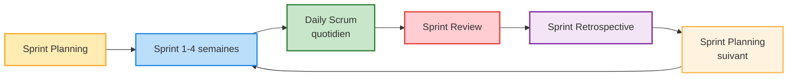

# Cours de Méthodes Agiles

# Méthode Scrum

## Trois grands rôles principaux 

<strong>Product Owner</strong> : Définit les exigences et priorités et représente le client dans le projet (Tuteur)

- **Vision du produit** : Porte la vision globale et s’assure que chaque fonctionnalité a du sens.
- **Gestion du Product Backlog** : Tient à jour et priorise la liste des tâches (backlog voir exemple ⬇️) selon la valeur pour le client.
- **Interface parties prenantes** : Recueille les besoins et communique avec clients et équipe.
- **Validation** : Accepte ou refuse les livrables à chaque sprint.
- **Décisions rapides** : Répond vite aux questions et fixe les priorités.
- **Maximisation de la valeur** : Oriente l’équipe sur ce qui apporte le plus de valeur.

<strong>Équipe de Développement</strong> : L’équipe de développement est composée de professionnels qui réalisent le travail technique nécessaire pour livrer les incréments du produit à chaque sprint. Elle est auto-organisée, pluridisciplinaire et responsable de la qualité des livrables. Ses principales responsabilités sont :

- **Polyvalence et multitâche** : Chaque membre peut intervenir sur plusieurs aspects du projet (développement, tests, documentation, etc.), favorisant la flexibilité et la réactivité de l’équipe.
- **Développer et tester** : Transformer le backlog en fonctionnalités prêtes à l’emploi.
- **S’auto-organiser** : Choisir ensemble comment atteindre les objectifs du sprint.
- **Collaborer** : Partager l’info, s’entraider, bien communiquer.
- **S’améliorer** : Identifier et appliquer des axes de progrès à chaque rétrospective.
- **Assurer la qualité** : Garantir un code fiable et bien documenté à chaque itération.

<strong>Scrum Master</strong> : Garant du cadre Scrum, il accompagne l’équipe et s’assure du respect des pratiques agiles (Membre de la SAE).

- **Facilitateur** : Organise et anime les cérémonies Scrum (Daily, Sprint Planning, Review, Rétrospective).
- **Suppression des obstacles** : Aide l’équipe à identifier et lever les blocages.
- **Coach agile** : Accompagne l’équipe dans l’adoption et l’amélioration continue des pratiques agiles.
- **Protection de l’équipe** : Protège l’équipe des interruptions extérieures et veille à un environnement de travail sain.
- **Médiateur** : Favorise la communication et la résolution des conflits au sein de l’équipe.
- **Transmission de la culture agile** : Sensibilise l’équipe et les parties prenantes à l’esprit et aux valeurs agiles.

## Cycle des Sprints

### Description des Phases (événements) 

**Sprint Planning** : Planification du sprint, sélection des tâches du Product Backlog et estimation du travail.
Tache que l'on rentre généralement dans un Kanban. (voir exemple de Kanban ⬇️)

**Sprint (1-4 semaines)** : Période de développement où l'équipe travaille sur les tâches sélectionnées (userStory pour coller au cours).

**Daily Meeting**  
Réunion quotidienne de 15 minutes pour synchroniser l'équipe et identifier les obstacles.  
Constituée d'une réponse de chaque membre de l'équipe : 
1. Qu'ai-je fait hier ?
2. Que vais-je faire aujourd'hui ?
3. Ai-je rencontré des obstacles ou des problèmes ?

**Sprint Review** : Démonstration du travail accompli aux parties prenantes et collecte des retours.

**Sprint Retrospective** : Réflexion sur le processus pour identifier les améliorations à apporter.
Question courante : 
- Qu'est-ce qui a bien fonctionné pendant ce sprint ?
- Qu'est-ce qui aurait pu mieux se passer ?
- Quels obstacles avons-nous rencontrés et comment les avons-nous surmontés (ou pas) ?
- Que pouvons-nous améliorer pour le prochain sprint ?
- Avons-nous respecté nos engagements et nos processus ?
- Y a-t-il des points de friction ou des tensions dans l'équipe ?
- Quelles actions concrètes allons-nous mettre en place pour progresser ?

**Sprint Planning suivant** : Retour au début du cycle pour planifier le prochain sprint.

## Les Artefacts
> ### Exemple de tableau Kanban
>
> | À faire                | En cours                | Terminé                |
> |------------------------|-------------------------|------------------------|
> | Rédiger la user story  | Développer la feature X | Corriger le bug Y      |
> | Préparer la réunion    | Écrire les tests unitaires | Mettre à jour la documentation |
> | Concevoir la maquette  |                         |                        |
>
> Chaque colonne représente un état d’avancement des tâches. Les tâches passent de « À faire » à « En cours » puis à « Terminé » au fil du sprint.

> ### Exemple de Product Backlog
>
> | Priorité | Utilisateur    | Fonctionnalité                                 | Estimation (points) | Statut   |
> |----------|----------------|------------------------------------------------|---------------------|----------|
> | 1        | Utilisateur    | Inscription à la plateforme                    | 5                   | À faire  |
> | 2        | Utilisateur    | Connexion à son compte                         | 3                   | À faire  |
> | 3        | Utilisateur    | Réinitialisation du mot de passe               | 2                   | À faire  |
> | 4        | Utilisateur    | Modification des informations du profil        | 5                   | À faire  |
> | 5        | Administrateur | Visualisation de la liste des utilisateurs     | 3                   | À faire  |
>
>L'estimation en points correspond au niveau de difficulté estimé  par l'équipe pour une tache donné (définit par exemple avec me scrum poker)
