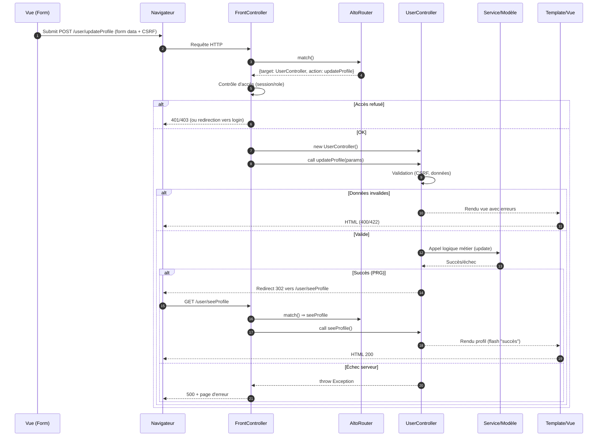

# Manipulation des BDD en PHP
## Couche de persistnace 
Une application web est généralement basée sur une architecture 3 tiers 

utilisateur -> couche utilisateur <-> couche métier <-> couche de persistance

## Manipulation de Bd en php 

- ne pas utiliser les mots clés mysql_ (pour eviter les attaques type inj. SQL)
- Utiliser le PDO (PHP Data Object)
    - Permet d'éviter les injections SQL
    - Obligatpire en PHP>=7

### 2 mots sur les injections SQL 

Attaque (bien répendue) de site web (malprotégés)

Exemple : 

## Intro au DAL (Data Access Layer)
- couche d'accés au données (DAL)
- couche gerer les données à la sauce Objet 
    - permet de gérer les data objet 

    - Table Data Gateway

