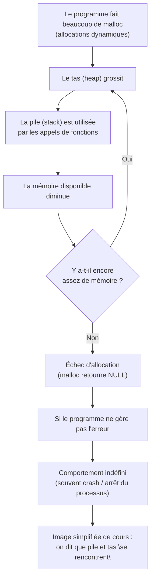
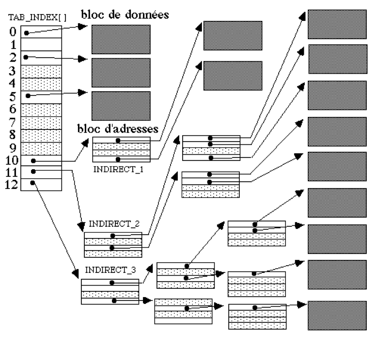

# Les processus 
## Notion 
c'est une instance dynamque de programme 

contient code et donnée 

## Géométrie d'un disque du dur 

#### Concrétement 

Un disque dur fonctionne de manière similaire à un vinyle : il est composé de plateaux circulaires qui tournent, et un bras mobile se déplace pour lire ou écrire les données. Sur chaque plateau, les informations sont organisées en pistes concentriques, et la tête de lecture/écriture du bras peut accéder à n’importe laquelle de ces pistes. Contrairement à l’idée que le fichier est lu en une seule fois sur toute la surface, les données d’un fichier peuvent être réparties sur plusieurs secteurs et pistes différentes du disque, que la tête va lire successivement.

## Le SGF (Système de Gestion de Fichier)

- But masque l'aspect "sectuer" pour manipuler que des fichier
- Les fichier sont fragmenté sur le disque 
- le plus simple : FAT Dos
    - FAT : File Allocation Table 

### SGF Unix

→ Pas de FAT dans le SGF Unix.
    À la place, on utilise des structures comme les *inodes*, qui contiennent des pointeurs vers les blocs de données et/ou des blocs d'adresses (pour les gros fichiers, plusieurs niveaux d’indirection sont utilisés) : cela permet de stocker des gros fichiers répartis sur le disque.

